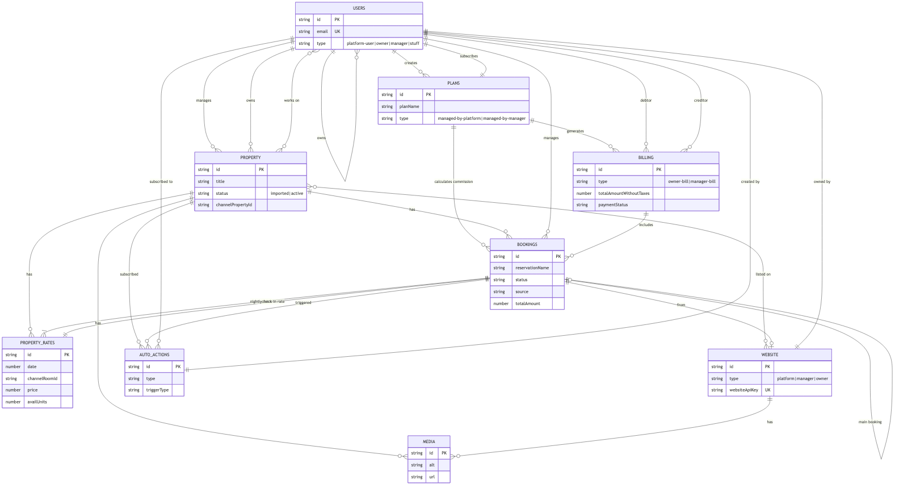
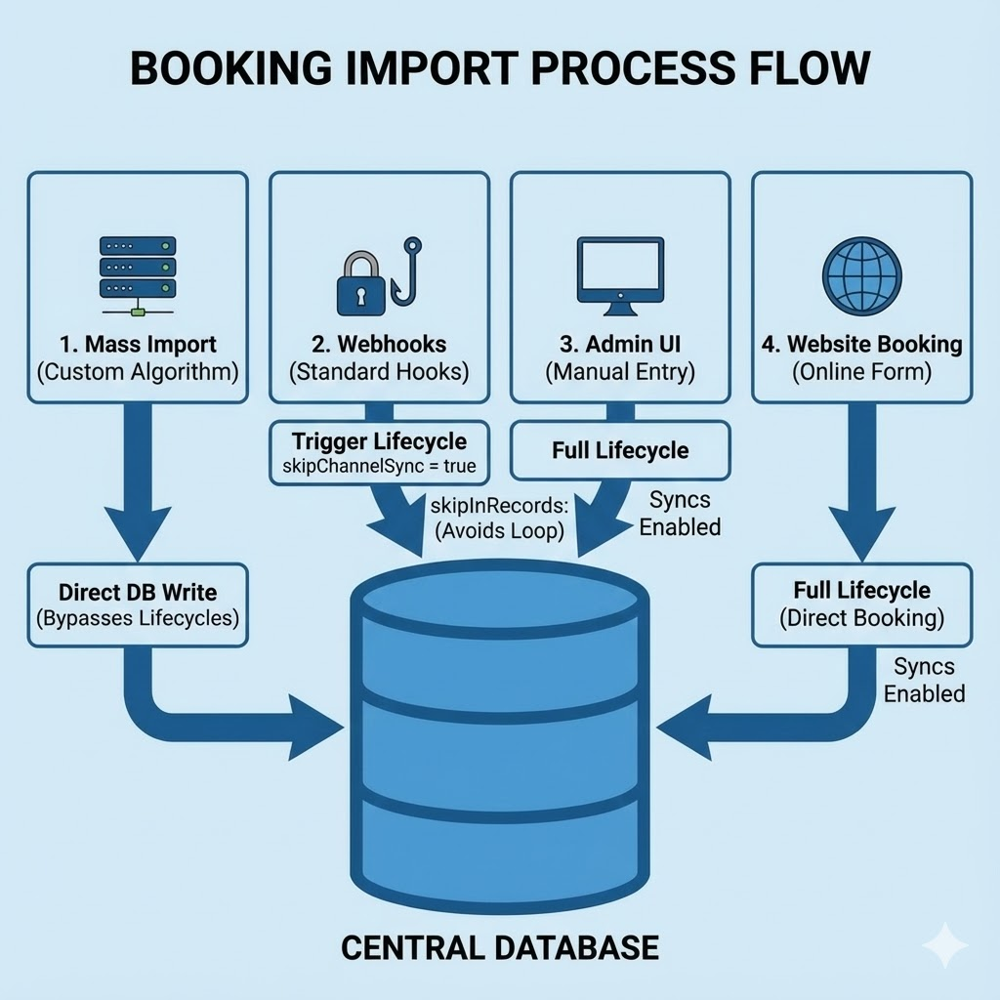
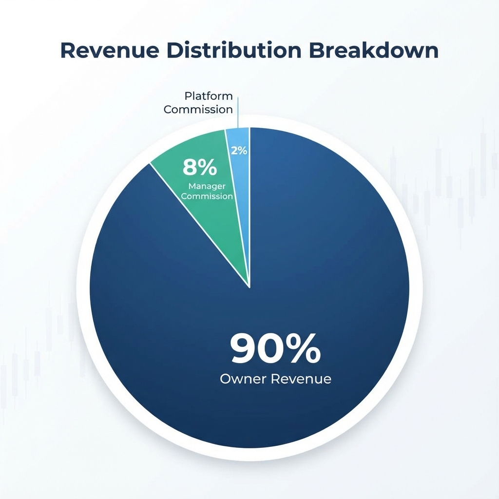
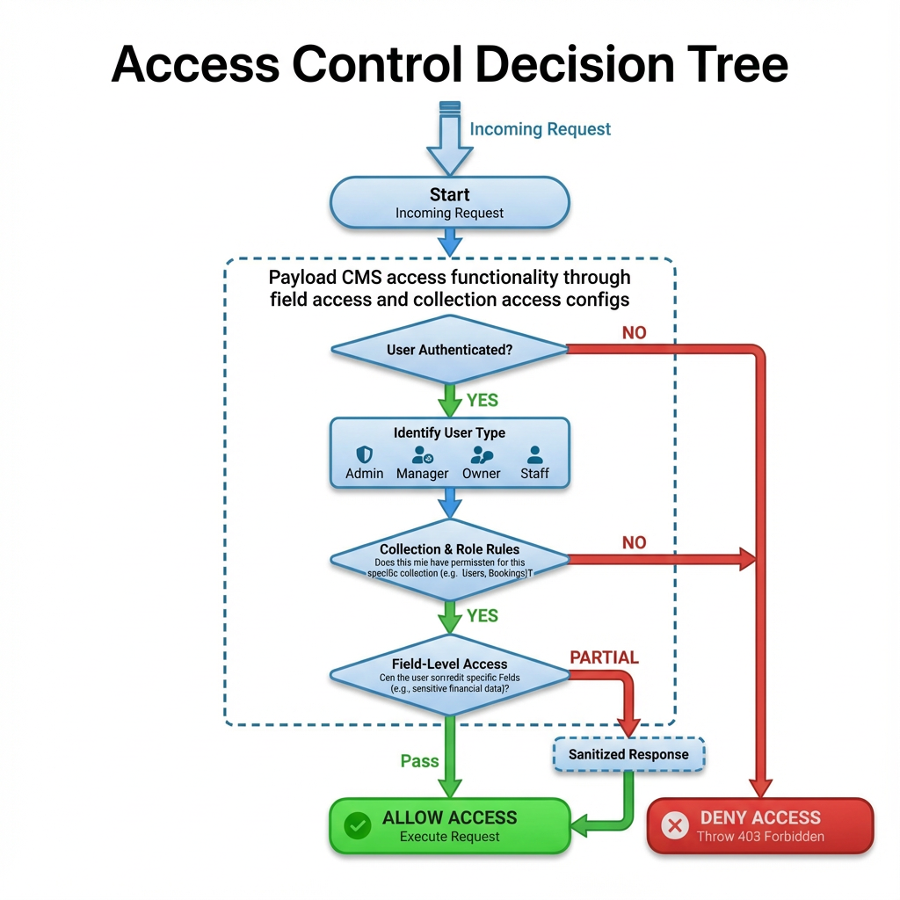

# ΠΟΛΥΤΕΧΝΕΙΟ ΚΡΗΤΗΣ

## ΣΧΟΛΗ ΗΛΕΚΤΡΟΛΟΓΩΝ ΜΗΧΑΝΙΚΩΝ ΚΑΙ ΜΗΧΑΝΙΚΩΝ ΥΠΟΛΟΓΙΣΤΩΝ

# ΣΧΕΔΙΑΣΜΟΣ ΚΑΙ ΥΛΟΠΟΙΗΣΗ ΠΛΑΤΦΟΡΜΑΣ ΔΙΑΧΕΙΡΙΣΗΣ ΤΟΥΡΙΣΤΙΚΩΝ ΚΑΤΑΛΥΜΑΤΩΝ ΜΕ ΕΜΦΑΣΗ ΣΤΟ RAPID DEVELOPMENT ΚΑΙ ΤΗΝ ΕΝΣΩΜΑΤΩΣΗ LLMs

**ΔΙΠΛΩΜΑΤΙΚΗ ΕΡΓΑΣΙΑ**

**ΘΕΟΔΩΡΟΣ ΜΠΑΡΚΑΣ**

**ΧΑΝΙΑ, ΝΟΕΜΒΡΙΟΣ 2025**

# ΠΝΕΥΜΑΤΙΚΑ ΔΙΚΑΙΩΜΑΤΑ

"Απαγορεύεται η αντιγραφή, αποθήκευση και διανομή της παρούσας εργασίας, εξ ολοκλήρου ή τμήματος αυτής, για εμπορικό σκοπό. Επιτρέπεται η ανατύπωση, αποθήκευση και διανομή για μη κερδοσκοπικό σκοπό, εκπαιδευτικού ή ερευνητικού χαρακτήρα, με την προϋπόθεση να αναφέρεται η πηγή προέλευσης. Ερωτήματα που αφορούν τη χρήση της εργασίας για άλλη χρήση θα πρέπει να απευθύνονται προς το συγγραφέα.

Οι απόψεις και τα συμπεράσματα που περιέχονται σε αυτό το έγγραφο εκφράζουν τον συγγραφέα και δεν πρέπει να ερμηνευθεί ότι αντιπροσωπεύουν τις επίσημες θέσεις του Πολυτεχνείου Κρήτης".

# ΕΠΙΤΡΟΠΗ

**Εξεταστική Επιτροπή:**

1. Καθ. Μιχαήλ Γ. Λαγουδάκης (Επιβλέπων)
2. Καθ. Αντώνιος Δεληγιαννάκης
3. Αν. Καθ. Βασίλειος Σαμολαδάς

# ΠΕΡΙΛΗΨΗ

Η παρούσα διπλωματική εργασία πραγματεύεται τον σχεδιασμό και την υλοποίηση της πλατφόρμας "Lunarety V2", ενός προηγμένου συστήματος διαχείρισης τουριστικών καταλυμάτων (Property Management System - PMS) που αξιοποιεί σύγχρονες τεχνολογίες για να προσφέρει λύσεις Rapid Development και ενσωμάτωση Τεχνητής Νοημοσύνης (LLMs). Σκοπός της εργασίας είναι η κάλυψη του κενού που υπάρχει στην αγορά για ένα εργαλείο που απευθύνεται σε διαχειριστές ακινήτων (Managers) οι οποίοι επιβλέπουν πολλαπλούς ιδιοκτήτες (Owners), προσφέροντας διαφάνεια, αυτοματισμό και ευκολία χρήσης που λείπει από τα παραδοσιακά Channel Managers.

Η μεθοδολογία ανάπτυξης βασίστηκε στη χρήση του PayloadCMS v3.0, το οποίο λειτουργεί ως ένα πλήρες backend framework εντός του Next.js, προσφέροντας Code-First ορισμό δομών δεδομένων και ισχυρή τυποποίηση μέσω TypeScript. Η βάση δεδομένων υλοποιήθηκε σε PostgreSQL με χρήση Drizzle ORM, εξασφαλίζοντας ακεραιότητα και ταχύτητα. Η πλατφόρμα ακολουθεί αρχιτεκτονική Monorepo και είναι σχεδιασμένη για Serverless Deployment (π.χ. Vercel), επιτρέποντας στους διαχειριστές να ξεκινούν με μηδενικό κόστος υποδομής και να κλιμακώνονται ανάλογα με τις ανάγκες τους.

Κεντρικό στοιχείο της καινοτομίας αποτελεί η ενσωμάτωση Large Language Models (LLMs) μέσω του Vercel AI SDK και του OpenRouter, προσφέροντας έξυπνες λειτουργίες σε πολλαπλά επίπεδα. Επιπλέον, αναπτύχθηκε ένας μηχανισμός "Auto Actions" για την πλήρη αυτοματοποίηση της επικοινωνίας μέσω πολλαπλών καναλιών (Email, OTA Messages, Telegram).

Η εργασία συνεισφέρει στην κατανόηση του τρόπου με τον οποίο οι σύγχρονες αρχιτεκτονικές λογισμικού και τα εργαλεία Rapid Development μπορούν να μετασχηματίσουν επιχειρησιακές διαδικασίες, προσφέροντας λύσεις υψηλής αξίας με μειωμένο χρόνο ανάπτυξης και συντήρησης.

# ABSTRACT

This diploma thesis deals with the design and implementation of the "Lunarety V2" platform, an advanced Property Management System (PMS) that leverages modern technologies to offer Rapid Development solutions and Large Language Model (LLM) integration. The purpose of this work is to bridge the market gap for a tool tailored to Property Managers overseeing multiple Owners, offering transparency, automation, and ease of use often missing from traditional Channel Managers.

The development methodology was based on PayloadCMS v3.0, acting as a full backend framework within Next.js, offering Code-First data structure definitions and strong typing via TypeScript. The database was implemented in PostgreSQL using Drizzle ORM, ensuring data integrity and performance. The platform follows a Monorepo architecture and is designed for Serverless Deployment (e.g., Vercel), allowing managers to start with zero infrastructure costs and scale as needed.

A key innovation element is the integration of Large Language Models (LLMs) via Vercel AI SDK and OpenRouter, offering smart features at multiple levels. Furthermore, an "Auto Actions" mechanism was developed to fully automate communication through multiple channels (Email, OTA Messages, Telegram).

This work contributes to understanding how modern software architectures and Rapid Development tools can transform business processes, delivering high-value solutions with reduced development and maintenance time.

# ΠΡΟΛΟΓΟΣ

Θα ήθελα να ευχαριστήσω... (Placeholder for Acknowledgements)

# ΠΙΝΑΚΑΣ ΠΕΡΙΕΧΟΜΕΝΩΝ

1. **ΕΙΣΑΓΩΓΗ**
   - 1.1 Αντικείμενο της Μελέτης
   - 1.2 Σκοπός της Διπλωματικής Εργασίας
   - 1.3 Το Κενό στην Αγορά: Managers και Owners
   - 1.4 Συνεισφορά στο Rapid Development
2. **ΘΕΩΡΗΤΙΚΟ ΥΠΟΒΑΘΡΟ**
   - 2.1 Σύγχρονες Αρχιτεκτονικές Web
     - 2.1.1 TypeScript και Type Consistency
     - 2.1.2 PayloadCMS: Backend Framework vs CMS
     - 2.1.3 Next.js, Server Actions και Monorepo
     - 2.1.4 PostgreSQL και Drizzle ORM
     - 2.1.5 Shadcn UI, React και Zustand
     - 2.1.6 Swagger/OpenAPI και Code Generation
   - 2.2 Large Language Models (LLMs)
     - 2.2.1 Vercel AI SDK και Streaming
     - 2.2.2 OpenRouter και Πρόσβαση σε Μοντέλα
   - 2.3 Channel Managers και Διασυνδεσιμότητα
3. **ΜΕΘΟΔΟΛΟΓΙΑ & ΑΝΑΛΥΣΗ ΑΠΑΙΤΗΣΕΩΝ**
   - 3.1 Ρόλοι και Ιεραρχία Χρηστών
   - 3.2 Αρχιτεκτονική Συστήματος (Monorepo)
   - 3.3 Μοντέλο Δεδομένων και Σχέσεις
4. **ΥΛΟΠΟΙΗΣΗ**
   - 4.1 Διαχείριση Κρατήσεων και Συγχρονισμός (Sync Logic)
   - 4.2 Μηχανισμός Auto Actions
     - 4.2.1 Κατηγορίες Auto Actions
     - 4.2.2 Κανάλια Επικοινωνίας (Telegram, OTA, Email)
   - 4.3 Αυτοματοποιημένη Παραγωγή Ιστοσελίδων
     - 4.3.1 Δομή και Λειτουργία Website
     - 4.3.2 Deploy URL & Vercel Integration
     - 4.3.3 Επιχειρηματικές Ευκαιρίες (Platform as OTA)
     - 4.4 Περιβάλλον Χρήστη (Platform UI) 4.4.1 Dashboard & Calendar (Λειτουργικότητα)
     - 4.4.2 Σύστημα Μηνυμάτων (Chat & AI)
     - 4.4.3 Διαχείριση Δικαιωμάτων και Drawers
5. **ΑΠΟΤΕΛΕΣΜΑΤΑ**
   - 5.1 Παρουσίαση της Πλατφόρμας
   - 5.2 Παρουσίαση του Generated Website
   - 5.3 Smart Features & LLM Integration
6. **ΣΥΖΗΤΗΣΗ**
7. **ΣΥΜΠΕΡΑΣΜΑΤΑ**
8. **ΒΙΒΛΙΟΓΡΑΦΙΑ**
9. **ΠΑΡΑΡΤΗΜΑΤΑ**

# ΚΕΦΑΛΑΙΟ 1: ΕΙΣΑΓΩΓΗ

## 1.1 Αντικείμενο της Μελέτης

Το αντικείμενο της παρούσας διπλωματικής εργασίας είναι ο σχεδιασμός και η ανάπτυξη ενός ολοκληρωμένου πληροφοριακού συστήματος, του "Lunarety V2", για τη διαχείριση τουριστικών καταλυμάτων. Η πλατφόρμα δεν αποτελεί απλώς ένα ακόμη PMS, αλλά μια ολιστική λύση που στοχεύει στην κεντρικοποίηση των λειτουργιών που απαιτούνται από επαγγελματίες διαχειριστές (Managers) και τους πελάτες τους, τους ιδιοκτήτες ακινήτων (Owners). Πέρα από τις βασικές λειτουργίες διαχείρισης κρατήσεων και συγχρονισμού ημερολογίων, η πλατφόρμα ενσωματώνει προηγμένες δυνατότητες Τεχνητής Νοημοσύνης (LLMs) για την υποβοήθηση της επικοινωνίας και την παροχή έξυπνων υπηρεσιών.

## 1.2 Σκοπός της ΔΕ

Ο κύριος σκοπός της εργασίας είναι η δημιουργία ενός εργαλείου που μειώνει δραστικά τον διοικητικό φόρτο και εκσυγχρονίζει τις διαδικασίες διαχείρισης. Ειδικότερα, επιδιώκεται:

- Η δημιουργία ενός robust συστήματος διαχείρισης σχέσεων Manager-Owner, προσφέροντας διαφάνεια και αυτοματοποιημένη ενημέρωση.
- Η ενσωμάτωση δυνατοτήτων LLM (Large Language Models) τόσο για την υποβοήθηση των χρηστών στη σύνταξη μηνυμάτων όσο και για την παροχή smart features στους επισκέπτες μέσω των ιστοσελίδων των καταλυμάτων.
- Η υλοποίηση ενός ευέλικτου συστήματος "Auto Actions" τριών επιπέδων για την πλήρη αυτοματοποίηση των εργασιών.
- Η απρόσκοπτη διασύνδεση με τον Channel Manager "Beds24", με αρχιτεκτονική πρόβλεψη για μελλοντική προσθήκη άλλων παρόχων.

## 1.3 Το Κενό στην Αγορά: Managers και Owners

Η παρούσα εργασία απευθύνεται κυρίως σε επαγγελματίες Property Managers που διαχειρίζονται χαρτοφυλάκια ακινήτων που ανήκουν σε τρίτους (Owners). Στην τρέχουσα αγορά, παρατηρείται ένα σημαντικό κενό:

- Οι Managers συχνά αναγκάζονται να χρησιμοποιούν πολύπλοκα λογισμικά Channel Managers, τα οποία είναι δύσχρηστα για τους Owners ή το απλό προσωπικό.
- Η ενημέρωση των Owners για κρατήσεις, πληρότητες και οικονομικά στοιχεία γίνεται συχνά χειροκίνητα (τηλέφωνα, excel, emails), οδηγώντας σε λάθη και καθυστερήσεις.
- Η δημιουργία λογαριασμών για Owners μέσα στα υπάρχοντα Channel Managers είναι συχνά δαπανηρή ή πολύπλοκη διαδικασία.

Το Lunarety V2 έρχεται να καλύψει αυτό το κενό, προσφέροντας μια ενδιάμεση, φιλική προς τον χρήστη πλατφόρμα, όπου ο Manager ορίζει τα δικαιώματα, τις συνδρομές και την πρόσβαση των Owners, παρέχοντάς τους ακριβώς την πληροφορία που χρειάζονται σε πραγματικό χρόνο.

## 1.4 Συνεισφορά στο Rapid Development

Πέρα από την επιχειρησιακή της αξία, η εργασία αυτή αποτελεί μελέτη περίπτωσης για το πώς σύγχρονες τεχνολογίες (Next.js, PayloadCMS, Serverless) συμβάλλουν στο Rapid Application Development (RAD). Η δυνατότητα γρήγορης ανάπτυξης, εύκολου deployment (Serverless) και άμεσης προσαρμογής (Code-First schema) επιτρέπει σε μικρές ομάδες ή μεμονωμένους developers να παράγουν λογισμικό επιχειρησιακού επιπέδου (Enterprise Grade) σε ελάχιστο χρόνο.

# ΚΕΦΑΛΑΙΟ 2: ΘΕΩΡΗΤΙΚΟ ΥΠΟΒΑΘΡΟ

## 2.1 Σύγχρονες Αρχιτεκτονικές Web


_Εικόνα 2.1: Το τεχνολογικό stack της πλατφόρμας (Next.js, PayloadCMS, PostgreSQL, κ.α.)._

### 2.1.1 TypeScript και Type Consistency

### 2.1.1 TypeScript και Type Consistency

Η επιλογή της TypeScript έναντι της JavaScript αποτέλεσε μονόδρομο για την ανάπτυξη μιας σύγχρονης, κλιμακώσιμης εφαρμογής. Η στατική τυποποίηση (static typing) που προσφέρει εξασφαλίζει "Type Consistency" σε όλο το εύρος της εφαρμογής (Fullstack). Αυτό σημαίνει ότι τα δεδομένα που επιστρέφει το Backend είναι εγγυημένα συμβατά με αυτά που περιμένει το Frontend, μειώνοντας δραματικά τα runtime errors και επιταχύνοντας την ανάπτυξη μέσω του IntelliSense.

### 2.1.2 PayloadCMS: Backend Framework vs CMS

Το PayloadCMS (ειδικά από την έκδοση 3.0 και μετά) διαφοροποιείται σημαντικά από τα παραδοσιακά CMS (όπως το WordPress ή το Strapi). Λειτουργεί πρωτίστως ως ένα Backend Framework που τρέχει εντός του Next.js, παρόμοια με το Django ή το Laravel, αλλά με τη δύναμη του TypeScript.

- **Code-First Collections**: Οι δομές δεδομένων (Collections) ορίζονται αποκλειστικά μέσω κώδικα (TypeScript objects), λειτουργώντας ταυτόχρονα ως σχήμα βάσης δεδομένων, μοντέλο API και διεπαφή διαχείρισης.
- **Next.js Integration**: Το backend (Admin panel, API routes, Auth) είναι ενσωματωμένο στην εφαρμογή Next.js, μετατρέποντάς την σε μια full-stack λύση χωρίς την ανάγκη ξεχωριστού server.

### 2.1.3 Next.js, Server Actions και Monorepo

Το Next.js επιλέχθηκε όχι μόνο για τις δυνατότητες Rendering (SSR, SSG) αλλά και για την άριστη συμβατότητά του με Serverless υποδομές.

- **Server Actions**: Μια κρίσιμη λειτουργία που επιτρέπει στο Frontend να καλεί συναρτήσεις του Backend απευθείας, χωρίς την ανάγκη ρητού ορισμού API Endpoints. Αυτό απλοποιεί τη διαχείριση δεδομένων και διατηρεί την τυποποίηση (types) από άκρη σε άκρη.
- **Monorepo**: Η διατήρηση όλου του κώδικα (Frontend, Backend, Webhooks) σε ένα ενιαίο Repository επιτρέπει την κοινή χρήση τύπων και utilities, εξαλείφοντας την ανάγκη για συγχρονισμό μεταξύ διαφορετικών projects.

### 2.1.4 PostgreSQL και Drizzle ORM

Η πλατφόρμα βασίζεται στην PostgreSQL, μια ισχυρή σχεσιακή βάση δεδομένων. Η επικοινωνία με τη βάση γίνεται μέσω του Drizzle ORM, το οποίο είναι πλήρως συμβατό με το PayloadCMS.

- **Low-Level Capabilities**: Το Drizzle επιτρέπει στον developer να γράψει σύνθετα SQL queries όταν οι abstraction layers του CMS δεν επαρκούν, προσφέροντας απόλυτο έλεγχο στην απόδοση.
- **Type Safety**: Πλήρης τυποποίηση των queries βάσει του σχήματος της βάσης.

### 2.1.5 Shadcn UI, React και Zustand

Για το User Interface χρησιμοποιήθηκε το Shadcn UI, το οποίο διαφέρει από τις παραδοσιακές βιβλιοθήκες (όπως το Material UI) καθώς δεν είναι ένα npm package, αλλά κώδικας που αντιγράφεται μέσα στο project. Αυτό δίνει απόλυτη ελευθερία παραμετροποίησης.

- **React**: Η βάση του frontend για τη δημιουργία επαναχρησιμοποιήσιμων components.
- **Zustand**: Χρησιμοποιήθηκε για τη διαχείριση της κατάστασης (state management) της εφαρμογής, προσφέροντας μια πιο απλή και ελαφριά εναλλακτική στο Redux.

### 2.1.6 Swagger/OpenAPI και Code Generation

Για την επικοινωνία μεταξύ της Πλατφόρμας και των Websites, χρησιμοποιήθηκε το πρότυπο OpenAPI (Swagger).

- **Generation**: Η βιβλιοθήκη `next-swagger-doc` παράγει αυτόματα το documentation του API.
- **Client**: Η βιβλιοθήκη `openapi-typescript-codegen` χρησιμοποιείται στο Website project για να παράγει έναν πλήρως τυποποιημένο client (SDK), εξασφαλίζοντας ότι το Website είναι πάντα συγχρονισμένο με τις αλλαγές στο API της πλατφόρμας.

## 2.2 Large Language Models (LLMs)

Η ενσωμάτωση LLMs (μέσω API όπως OpenAI ή Anthropic) μεταμορφώνει τις εφαρμογές από στατικά εργαλεία σε έξυπνους βοηθούς. Στο πλαίσιο του PMS, τα LLMs μπορούν να αναλύσουν το context μιας κράτησης και να προτείνουν απαντήσεις, να μεταφράσουν μηνύματα ή να λειτουργήσουν ως virtual concierges στις ιστοσελίδες των καταλυμάτων.

### 2.2.1 Vercel AI SDK και Streaming

Για την υλοποίηση των AI λειτουργιών χρησιμοποιήθηκε το **Vercel AI SDK (v5)**. Το SDK αυτό επιλέχθηκε διότι απλοποιεί δραματικά τη διαδικασία του **Streaming** (ροή δεδομένων), επιτρέποντας στο UI να εμφανίζει την απάντηση του AI σταδιακά (λέξη-λέξη) καθώς παράγεται, βελτιώνοντας την εμπειρία χρήστη.

### 2.2.2 OpenRouter και Πρόσβαση σε Μοντέλα

Η πλατφόρμα δεν συνδέεται απευθείας με έναν πάροχο (π.χ. OpenAI), αλλά χρησιμοποιεί το **OpenRouter**. Το OpenRouter λειτουργεί ως ένας ενδιάμεσος κόμβος (gateway) που παρέχει πρόσβαση σε πληθώρα μοντέλων (GPT-4, Claude 3.5 Sonnet, Llama 3, κ.α.) μέσω ενός ενιαίου API. Αυτό δίνει την ευελιξία στον χρήστη να επιλέξει το μοντέλο που ταιριάζει καλύτερα στις ανάγκες και το budget του, χωρίς αλλαγές στον κώδικα.

## 2.3 Channel Managers και Διασυνδεσιμότητα

Η επιλογή του **Beds24** ως Channel Manager δεν ήταν τυχαία. Επιλέχθηκε διότι:

1. **Δημοφιλία & Κόστος**: Είναι μια από τις πιο διαδεδομένες και οικονομικές λύσεις στην αγορά.
2. **Modern API**: Διαθέτει ένα σύγχρονο, comprehensive API με υποστήριξη OpenAPI, το οποίο επιτρέπει την εύκολη παραγωγή κώδικα (μέσω `swagger-typescript-api`) και την άμεση προσαρμογή σε μελλοντικά updates.

# ΚΕΦΑΛΑΙΟ 3: ΜΕΘΟΔΟΛΟΓΙΑ & ΑΝΑΛΥΣΗ ΑΠΑΙΤΗΣΕΩΝ

## 3.1 Ρόλοι και Ιεραρχία Χρηστών

Το σύστημα σχεδιάστηκε με γνώμονα την ιεραρχία Manager-Owner, υλοποιώντας ένα εύκαμπτο μοντέλο δικαιωμάτων που επιτρέπει τον έλεγχο σε κάθε επίπεδο.

### 3.1.1 Τύποι Χρηστών (User Types)

Η πλατφόρμα υποστηρίζει τέσσερις διακριτούς τύπους χρηστών:

| User Type       | Περιγραφή                       | Parent Relationship | Children                |
| --------------- | ------------------------------- | ------------------- | ----------------------- |
| `platform-user` | Administrators πλατφόρμας       | Κανένας             | Managers (managed view) |
| `manager`       | Property Managers               | Platform            | Owners, Staff           |
| `owner`         | Ιδιοκτήτες ακινήτων             | Manager             | Staff                   |
| `stuff`         | Προσωπικό (καθαριστές, υποδοχή) | Owner ή Manager     | Κανένας                 |

**Platform Users (Admins):**

- Πλήρης πρόσβαση σε όλα τα δεδομένα της πλατφόρμας (Admin View)
- Δημιουργία και διαχείριση Plans (πλάνα χρέωσης)
- Εποπτεία όλων των Managers, χωρίς να είναι "γονείς" τους ιεραρχικά, αλλά έχοντας δυνατότητα διαχείρισης.

**Managers:**

- Σύνδεση με Channel Manager (Beds24)
- Εισαγωγή και διαχείριση Properties
- Δημιουργία Owners και Staff
- Ορισμός δικαιωμάτων για τους υφισταμένους
- Δυνατότητα παραμετροποίησης των δικών τους access configurations για περιορισμό ευθύνης/κινδύνου
- Δημιουργία και διαχείριση Auto Actions
- Δημιουργία Websites για τα ακίνητα

**Owners:**

- Προβολή/επεξεργασία μόνο των ακινήτων που τους έχουν ανατεθεί
- Δικαιώματα καθορίζονται πλήρως από τον Manager
- Δημιουργία Staff που ανήκουν σε αυτούς

**Staff:**

- Ελάχιστα δικαιώματα (συνήθως view-only)
- Δεν μπορούν να δημιουργήσουν άλλους χρήστες
- Χρήσιμοι για εργασίες καθαρισμού, check-in, κ.λπ.

### 3.1.2 Ιεραρχικές Σχέσεις & Billing

Κάθε Owner ανήκει σε έναν Manager/Platform-User, ενώ το Staff μπορεί να ανήκει σε Manager ή Owner. Η σχέση αυτή καθορίζει την πρόσβαση και τη ροή των χρεώσεων. Κάθε Manager και Owner συνδέεται με ένα Plan που καθορίζει τις χρεώσεις και τα features.


_Εικόνα 3.1: Ιεραρχική δομή ρόλων χρηστών στην πλατφόρμα._

## 3.2 Αρχιτεκτονική Συστήματος (Monorepo)

Η πλατφόρμα υλοποιείται ως Monorepo, το οποίο εξασφαλίζει συνοχή μεταξύ των διαφορετικών components και διευκολύνει την κοινή χρήση τύπων και utilities.

### 3.2.1 Δομή Monorepo

```
lunarety-v2/
├── src/
│   ├── app/                    # Next.js App Router
│   │   ├── (frontend)/        # Frontend routes (calendar, messages, etc.)
│   │   └── (payload)/         # PayloadCMS admin routes
│   ├── apis/                  # External API integrations
│   │   └── channel-managers/  # Beds24 API, DTOs, sync logic
│   ├── collections/           # PayloadCMS collections (Users, Bookings, etc.)
│   ├── crons/                 # Scheduled jobs (hourly, nightly, monthly)
│   ├── endpoints/             # Custom API endpoints & webhooks
│   ├── lib/                   # Shared utilities and helpers
│   └── payload.config.ts      # PayloadCMS configuration
├── lunarety-v2-website/       # Separate public repo (template)
└── package.json
```

### 3.2.2 Βασικά Components

**PayloadCMS Core:**

- Headless CMS με PostgreSQL backend
- Αυτόματη δημιουργία REST και GraphQL API
- Admin panel για διαχείριση δεδομένων
- Type-safe collection definitions

**Next.js App Router:**

- Server-side rendering για SEO
- Server Actions για data mutations
- Middleware για authentication
- Dynamic routing για Calendar, Messages, Settings

**Channel Manager API Layer:**

- `ChannelManagerApi` object - central export point
- DTOs για μετατροπή Beds24 ↔ Payload formats
- Abstraction layer για μελλοντική υποστήριξη άλλων Channel Managers

Το κρίσιμο σημείο αυτής της αρχιτεκτονικής είναι ότι ολόκληρη η πλατφόρμα χρησιμοποιεί αυτές τις συναρτήσεις **χωρίς να είναι εξαρτημένη από το Beds24**. Οι υπόλοιπες μονάδες της εφαρμογής (hooks, cron jobs, webhooks) καλούν τα generic methods του `ChannelManagerApi` object, τα οποία εσωτερικά μεταφράζονται στις αντίστοιχες κλήσεις του συγκεκριμένου Channel Manager. Αυτός ο σχεδιασμός ακολουθεί το πρότυπο **Adapter Pattern**, όπου κάθε Channel Manager υλοποιεί μια κοινή "διεπαφή" (interface). Για την προσθήκη υποστήριξης νέου Channel Manager (π.χ. Hostaway, Lodgify), αρκεί η υλοποίηση των ίδιων συναρτήσεων με τα κατάλληλα DTOs για μετατροπή δεδομένων. Προς το παρόν, μόνο το Beds24 υποστηρίζεται πλήρως, αλλά η αρχιτεκτονική είναι έτοιμη για επέκταση.

### 3.2.3 External Integrations

| Service              | Σκοπός               | Αρχείο/Module                   |
| -------------------- | -------------------- | ------------------------------- |
| **Beds24 API**       | Channel Manager      | `apis/channel-managers/beds24/` |
| **Vercel AI SDK**    | AI text improvements | `lib/ai/`                       |
| **OpenRouter**       | LLM API proxy        | `lib/ai/`                       |
| **Telegram Bot API** | User notifications   | `lib/telegram/`                 |
| **Resend**           | Email sending        | `lib/email/`                    |


_Εικόνα 3.2: Διάγραμμα αρχιτεκτονικής συστήματος (Monorepo)._

Παράλληλα, το `lunarety-v2-website` αποτελεί ένα ξεχωριστό public project στο GitHub, σχεδιασμένο να λειτουργεί ως template για τις ιστοσελίδες των καταλυμάτων. Επικοινωνεί με την πλατφόρμα μέσω ενός secure API endpoint χρησιμοποιώντας `WEBSITE_API_KEY`.

## 3.3 Μοντέλο Δεδομένων και Σχέσεις

### 3.3.1 Κύριες Οντότητες (Collections)

Η βάση δεδομένων (PostgreSQL) οργανώνεται γύρω από τις εξής κύριες collections:

| Collection       | Περιγραφή            | Σημαντικά Fields                                    |
| ---------------- | -------------------- | --------------------------------------------------- |
| `users`          | Χρήστες πλατφόρμας   | `type`, `managedBy`, `ownedBy`, `settings`          |
| `property`       | Καταλύματα           | `manager`, `owner`, `channelPropertyId`, `rooms`    |
| `bookings`       | Κρατήσεις            | `property`, `resource`, `pricing`, `messages`       |
| `property-rates` | Τιμές ανά ημέρα      | `property`, `date`, `channelRoomId`, `availability` |
| `billing`        | Χρεώσεις/Τιμολόγια   | `type`, `ownerDebtor`, `managerCreditor`            |
| `auto-actions`   | Κανόνες αυτοματισμού | `type`, `triggerType`, `template`                   |
| `plans`          | Πλάνα χρέωσης        | `planCommission`, `features`                        |
| `website`        | Generated websites   | `apiKey`, `type`, `properties`                      |

### 3.3.2 Σχέσεις Μεταξύ Οντοτήτων

**Property ↔ Users:**

- Κάθε Property έχει έναν `manager` (υποχρεωτικό)
- Κάθε Property μπορεί να έχει έναν `owner` (προαιρετικό)

**Bookings ↔ Property ↔ Users:**

- Κάθε Booking ανήκει σε ένα Property
- Το Access control βασίζεται στη σχέση Property → Manager/Owner: οι χρήστες (Managers, Owners, Staff) έχουν πρόσβαση μόνο στα bookings των properties που τους αντιστοιχούν, με τα δικαιώματά τους να καθορίζονται τόσο από τον ρόλο τους (user type) όσο και από τις ρυθμίσεις του Plan τους (features)

**Property Rates ↔ Property ↔ Bookings:**

- Κάθε Rate συνδέεται με μια ημέρα και ένα δωμάτιο
- Τα Bookings συνδέονται με τα rates μέσω `relatedRates`
- Join field `bookingsStayingOnThisNight` για reverse lookup

**Auto Actions ↔ Booking ↔ Users/Properties:**

- Κάθε Auto Action ενεργοποιείται (Trigger) από γεγονότα που αφορούν ένα **Booking**.
- Συνδέει και χρησιμοποιεί δεδομένα από πολλά Properties και Users για να διαμορφώσει το μήνυμα/ενέργεια.
- Τα Properties μπορούν να "εγγραφούν" (subscribe) σε Auto Actions στα οποία έχουν δικαίωμα προβολής: είτε ως Users για να λαμβάνουν ειδοποιήσεις σχετικά με τα bookings τους, είτε ως Properties για να αποστέλλουν αυτόματα μηνύματα στους φιλοξενούμενους κατά τη διάρκεια συγκεκριμένων events (π.χ. check-in, νέα κράτηση).

**Website ↔ User ↔ Properties:**

- Κάθε Website διαχειρίζεται από έναν User (Owner ή Manager).
- Η σχέση Website-Properties είναι many-to-many: ένα Website μπορεί να προβάλλει πολλαπλά Properties, και ένα Property μπορεί να εμφανίζεται σε πολλαπλά Websites (π.χ. ένα ίδιο κατάλυμα μπορεί να υπάρχει τόσο στο owner website όσο και σε ένα συγκεντρωτικό platform website του Manager).

**Users ↔ Billing:**

- Κάθε User έχει πολλαπλά Billing records.
- Η σχέση είναι διπλή: Ο User μπορεί να είναι Debtor (οφειλέτης) ή Creditor (πιστωτής) σε ένα Billing record.

### 3.3.3 Hook System και Lifecycle

Το PayloadCMS παρέχει ένα ισχυρό σύστημα hooks που χρησιμοποιείται εκτενώς:

| Hook Type      | Εκτελείται          | Χρήση στην Πλατφόρμα                            |
| -------------- | ------------------- | ----------------------------------------------- |
| `beforeChange` | Πριν την αποθήκευση | Sync με Channel Manager, Commission calculation |
| `afterChange`  | Μετά την αποθήκευση | Touch related rates, Trigger auto-actions       |
| `beforeRead`   | Πριν την ανάγνωση   | Data transformation                             |
| `afterRead`    | Μετά την ανάγνωση   | Computed fields, formatting                     |

**Παράδειγμα Hook Chain για Booking Creation:**

1. `linkRatesToBooking` (beforeChange) - Σύνδεση με property rates
2. `syncChannelBooking_beforeChangeHook` (beforeChange) - Υπολογισμός commissions, sync με Beds24
3. `touchNightlyRates` (afterChange) - Ενημέρωση σχετικών rates

Στην πλατφόρμα χρησιμοποιούνται κυρίως τα **beforeChange** και **afterChange** hooks, καθώς καλύπτουν το μεγαλύτερο μέρος της business logic: ο υπολογισμός δεδομένων πριν την αποθήκευση (beforeChange) και οι cascade ενέργειες μετά την αποθήκευση (afterChange) όπως η ενεργοποίηση Auto Actions ή η ενημέρωση σχετιζόμενων records.


_Εικόνα 3.3: Entity Relationship Diagram (ERD) του μοντέλου δεδομένων της πλατφόρμας._

# ΚΕΦΑΛΑΙΟ 4: ΥΛΟΠΟΙΗΣΗ

## 4.1 Διαχείριση Κρατήσεων και Συγχρονισμός

Η διαχείριση κρατήσεων αποτελεί τον πυρήνα της πλατφόρμας και απαιτεί προσεκτικό σχεδιασμό για να εξασφαλιστεί η ακεραιότητα των δεδομένων, η απόδοση και η συνέπεια μεταξύ της τοπικής βάσης δεδομένων και του Channel Manager. Η υλοποίηση διακρίνει τέσσερις διαφορετικές μεθόδους εισαγωγής κρατήσεων, καθεμία με τη δική της στρατηγική και lifecycle.

### 4.1.1 Αρχική Σύνδεση και Ρύθμιση Webhooks

Η διασύνδεση με το Beds24 ακολουθεί μια συγκεκριμένη ροή αρχικοποίησης:

1. **Σύνδεση Λογαριασμού**: Ο Manager εισάγει το Refresh Token του Beds24 στις ρυθμίσεις του λογαριασμού του.
2. **Token Exchange**: Το σύστημα αυτόματα ανταλλάσσει το Refresh Token για ένα Access Token μέσω του `b24ApiRefreshToken()`, το οποίο χρησιμοποιείται για όλες τις επόμενες κλήσεις API.
3. **User ID Retrieval**: Ανακτάται το `channelManagerUserId` από το Beds24 για χρήση σε μελλοντικές κλήσεις API.
4. **Initial Property Import**: Εκτελείται μαζική εισαγωγή όλων των Properties και των Property Rates μέσω της `syncProperties()`.
5. **Webhook Configuration**: Για κάθε Property, το σύστημα αυτόματα ρυθμίζει το Beds24 ώστε να στέλνει Webhooks στο endpoint `/api/webhooks/channel-managers/beds24/bookings` με ένα μοναδικό `secretPropertyKey` στο header.

```typescript
// Αυτόματη ρύθμιση webhooks κατά την εισαγωγή properties
await api.properties.propertiesCreate(
  propertiesWithRates.map(({ convertedProperty }) => ({
    id: Number(convertedProperty.channelPropertyId),
    webhooks: {
      url: `${process.env.NEXT_PUBLIC_URL}/api/webhooks/channel-managers/beds24/bookings`,
      customHeader: `secretPropertyKey: ${convertedProperty.secretPropertyKey}`,
      version: "twoWithPersonalData",
      additionalData: "none",
    },
  }))
);
```

### 4.1.2 Μέθοδοι Εισαγωγής Κρατήσεων

Η πλατφόρμα υποστηρίζει τέσσερις διαφορετικές μεθόδους δημιουργίας/ενημέρωσης κρατήσεων, καθεμία με διαφορετικό lifecycle:



_Περιγραφή διαγράμματος: Flowchart με 4 διακριτά paths: (1) **Mass Import**: Direct DB write (custom algorithm), παρακάμπτει lifecycles. (2) **Webhooks**: Trigger lifecycle αλλά `skipChannelSync` = true (αποφυγή loop). (3) **Admin UI**: Full lifecycle (Syncs enabled). (4) **Website Booking**: Full lifecycle (Syncs enabled, Direct Booking)._

#### Α) Mass Import (Property Syncing) - Στρατηγική Μαζικής Εισαγωγής

Κατά την αρχική εισαγωγή ή τον περιοδικό συγχρονισμό, η πλατφόρμα χρειάζεται να εισάγει εκατοντάδες ή χιλιάδες κρατήσεις. Σε αυτή την περίπτωση, η εκτέλεση του πλήρους lifecycle για κάθε κράτηση θα ήταν απαγορευτικά αργή.

**Στρατηγική Βελτιστοποίησης:**

- Χρήση της `payload.db.create()` και `payload.db.updateOne()` αντί των `payload.create()` και `payload.update()`.
- Αυτό παρακάμπτει τα `beforeChange` και `afterChange` hooks, αποφεύγοντας τις κλήσεις API προς το Channel Manager (που θα ήταν περιττές αφού τα δεδομένα έρχονται ήδη από εκεί).
- Η μετατροπή δεδομένων γίνεται μέσω της `dtoPayloadToPayloadDb()` που προσαρμόζει τη δομή για απευθείας εγγραφή στη βάση.

```typescript
// Mass import - Direct DB operations (bypassing hooks)
const syncBookingsOperations = async (
  bookingsToCreate: RequiredDataFromCollectionSlug<"bookings">[],
  bookingsToUpdate: Array<{
    id: number;
    data: RequiredDataFromCollectionSlug<"bookings">;
  }>,
  bookingsToDelete: Booking[]
) => {
  // CREATE - Απευθείας στη βάση, χωρίς lifecycle
  for (const booking of bookingsToCreate) {
    await payload.db.create({
      collection: "bookings",
      data: dtoPayloadToPayloadDb(booking),
    });
  }

  // UPDATE - Απευθείας στη βάση, χωρίς lifecycle
  for (const { id, data } of bookingsToUpdate) {
    await payload.db.updateOne({
      collection: "bookings",
      id: id,
      data: dtoPayloadToPayloadDb(data),
    });
  }
};
```

**Αλγόριθμος Σύγκρισης:**
Πριν την εκτέλεση των operations, η `getSyncBookingsOperations()` συγκρίνει τις κρατήσεις του Channel Manager με αυτές της βάσης:

1. **bookingsToCreate**: Κρατήσεις που υπάρχουν στο Channel Manager αλλά όχι στη βάση (matching by `channelBookingId`).
2. **bookingsToUpdate**: Κρατήσεις που υπάρχουν και στα δύο - εφαρμόζεται merge logic για διατήρηση τοπικών αλλαγών.
3. **bookingsToDelete**: Κρατήσεις που υπάρχουν στη βάση αλλά διαγράφηκαν από το Channel Manager.

#### Β) Webhook Updates (Channel Manager Triggers) - Ασύγχρονη Ενημέρωση

Όταν μια κράτηση δημιουργείται ή ενημερώνεται στο Beds24 (π.χ. από Booking.com, Airbnb, ή το ίδιο το Beds24), η πλατφόρμα λαμβάνει ένα webhook notification.

**Ροή Επεξεργασίας Webhook:**

1. **Authentication**: Το webhook περιέχει το `secretPropertyKey` στο header, το οποίο χρησιμοποιείται για να εντοπιστεί το αντίστοιχο Property.
2. **Transaction Start**: Ξεκινά ένα database transaction για να εξασφαλιστεί η atomicity.
3. **Property Lookup**: Αναζήτηση του Property με τα σχετικά PropertyRates για τις ημερομηνίες της κράτησης.
4. **Booking Transform**: Μετατροπή του Beds24 booking format στο Payload booking format μέσω της `dtoBeds24BookingToBooking()`.
5. **Upsert Logic**: Αν η κράτηση δεν υπάρχει (by `channelBookingId`), δημιουργείται. Αλλιώς, ενημερώνεται.
6. **Message Merging**: Τα μηνύματα συγχωνεύονται αποφεύγοντας duplicates βάσει `channelMessageId`.
7. **Instant Triggers**: Εκτελούνται τα `on-new-message` και `on-update` Auto Actions.
8. **Transaction Commit/Rollback**: Commit σε επιτυχία, rollback σε σφάλμα.

**Κρίσιμο: skipChannelSync Flag**

Κατά την αποθήκευση της κράτησης μέσω webhook, το σύστημα θέτει `skipChannelSync: true` στα data:

```typescript
const createBookingRes = await payload.create({
  collection: "bookings",
  data: { ...dtoPayloadToPayloadDb(newBooking), skipChannelSync: true },
  req: { transactionID: transactionId },
});
```

Αυτό είναι κρίσιμο γιατί αποτρέπει το `syncChannelBooking_beforeChangeHook` από το να στείλει την κράτηση πίσω στο Beds24, δημιουργώντας ένα infinite loop. Το Channel Manager ήδη γνωρίζει για αυτή την κράτηση - αυτός είναι ο λόγος που μας έστειλε το webhook.

**Συγχώνευση Μηνυμάτων:**

```typescript
const mergeMessages = (
  bookingFound: PayloadBooking,
  newBooking: Partial<PayloadBooking>
): NonNullable<PayloadBooking["messages"]> => {
  const existingMessages = bookingFound.messages || [];
  const incomingMessages = newBooking.messages || [];

  // Αποφυγή duplicates βάσει channelMessageId
  const existingMessageIds = new Set(
    existingMessages.map((m) => m.channelMessageId)
  );
  const newUniqueMessages = incomingMessages.filter(
    (msg) => !existingMessageIds.has(msg.channelMessageId)
  );

  // Merge και ενημέρωση lastMessage
  newBooking.messages = [...existingMessages, ...newUniqueMessages];
  return newUniqueMessages.filter((msg) => msg.author === "guest");
};
```

#### Γ) UI-Based Booking Creation - Δημιουργία μέσω Διεπαφής

Όταν ένας Manager, Owner ή Staff με τα κατάλληλα δικαιώματα δημιουργεί ή επεξεργάζεται μια κράτηση μέσω του UI, εκτελείται το **πλήρες lifecycle**:

1. **beforeChange Hook**: Το `syncChannelBooking_beforeChangeHook` υπολογίζει τις προμήθειες (commissions) και συγχρονίζει με το Channel Manager.
2. **Commission Calculation**: Βάσει των Plans του Manager και του Owner, υπολογίζονται τα `platformCommission` και `managerCommission`.
3. **Channel Manager Sync**: Η κράτηση δημιουργείται/ενημερώνεται στο Beds24 μέσω API.
4. **Rate Linking**: Το `linkRatesToBooking` hook συνδέει την κράτηση με τα αντίστοιχα PropertyRates.
5. **afterChange Hook**: Το `touchNightlyRates` ενεργοποιεί τον επανυπολογισμό των rates.

**Υπολογισμός Προμηθειών (Commission Calculation):**

Το σύστημα υποστηρίζει τριπλή δομή προμηθειών:



_Απεικόνιση: Ένα διάγραμμα που δείχνει τον διαμοιρασμό εσόδων με παρόμοια αισθητική με το System Architecture Diagram._

| Commission Type      | Υπολογισμός                                             | Αποδέκτης           |
| -------------------- | ------------------------------------------------------- | ------------------- |
| `platformCommission` | `bookingTotal × platformPlan.commissionPercentage`      | Platform (Lunarety) |
| `managerCommission`  | `bookingTotal × ownerPlan.commissionPercentage`         | Manager             |
| Owner Revenue        | `bookingTotal - platformCommission - managerCommission` | Owner               |

```typescript
// Υπολογισμός commission
export const computeCommissionOfPlan = (
  booking: Partial<Booking>,
  plan: Plan
): number => {
  const bookingTotal = booking.pricing?.totalAmount ?? 0;

  // Έλεγχος για excluded bookings
  if (booking.excludedFromCommission) return 0;

  // Υπολογισμός βάσει percentage ή fixed amount
  if (plan.planCommission?.commissionType === "percentage") {
    const percentage = plan.planCommission.commissionPercentage ?? 0;
    return Math.round(bookingTotal * (percentage / 100) * 100) / 100;
  } else {
    return plan.planCommission?.fixedCommission ?? 0;
  }
};

// Εφαρμογή στο booking
const recalculateBookingCommissions = async (booking, manager, owner) => {
  const platformPlan = await getManagerPlan(manager.id);
  const ownerPlan = await getOwnerPlan(owner.id);

  booking.platformCommission = {
    commission: computeCommissionOfPlan(booking, platformPlan),
    plan: platformPlan.id,
  };

  booking.managerCommission = {
    commission: computeCommissionOfPlan(booking, ownerPlan),
    plan: ownerPlan.id,
  };
};
```

**Έξυπνη Αποφυγή Περιττών Sync:**

Δεν χρειάζεται κάθε αλλαγή να συγχρονίζεται με το Channel Manager. Η `shouldSyncToChannelManager()` ελέγχει αν άλλαξαν μόνο τα "σημαντικά" πεδία:

```typescript
const shouldSyncToChannelManager = (
  data: Partial<Booking>,
  originalDoc: Booking | undefined
): boolean => {
  // Πάντα sync στη δημιουργία
  if (!originalDoc) return true;

  // Πεδία που απαιτούν sync
  if (data.status !== originalDoc.status) return true;
  if (data.resource?.checkIn !== originalDoc.resource?.checkIn) return true;
  if (data.resource?.checkOut !== originalDoc.resource?.checkOut) return true;
  if (data.pricing?.totalAmount !== originalDoc.pricing?.totalAmount)
    return true;
  if (data.resource?.adults !== originalDoc.resource?.adults) return true;

  // Πεδία που ΔΕΝ απαιτούν sync (π.χ. μόνο αλλαγή ώρας check-in)
  // checkInStartOfDay changes DON'T trigger sync

  return false;
};
```

#### Δ) Website Booking Creation - Κρατήσεις από τον Ιστότοπο

Όταν ένας επισκέπτης κάνει κράτηση μέσω του generated website του καταλύματος, ακολουθείται η ίδια διαδικασία με το UI, με μερικές διαφορές:

- Το πεδίο `source` ορίζεται ως `'websitePlatform'`, `'websiteManager'` ή `'websiteOwner'` ανάλογα με τον τύπο του website.
- Συνδέεται το `website` relationship με το αντίστοιχο Website document.
- Υποστηρίζονται **Multi-room Bookings** μέσω του πεδίου `mainBooking` που συνδέει σχετικές κρατήσεις.

### 4.1.3 Σύστημα Σύνδεσης με Property Rates

Κάθε κράτηση συνδέεται με τα αντίστοιχα PropertyRate records μέσω του `relatedRates` field. Αυτό είναι κρίσιμο για:

- Τον υπολογισμό διαθεσιμότητας (ένα rate με booked unit δεν είναι διαθέσιμο)
- Τον υπολογισμό τιμών (η τιμή ανά νύχτα προέρχεται από το rate)
- Την ενημέρωση του ημερολογίου

**linkRatesToBooking Hook:**

```typescript
export const linkRatesToBooking: CollectionBeforeChangeHook<Booking> = async ({
  data,
  req,
}) => {
  // Εύρεση σχετικών rates για τη διάρκεια της κράτησης
  const rates = await payload.find({
    collection: "property-rates",
    where: {
      channelRoomId: { equals: data.resource.roomAndUnit.roomId },
      date: {
        greater_than_equal: data.resource.checkIn,
        less_than: data.resource.checkOut,
      },
    },
    limit: 10000,
  });

  data.relatedRates = {
    nightlyRates: rates.docs.map((rate) => rate.id),
    checkInRate: rates.docs.find((rate) => rate.date === data.resource.checkIn)
      ?.id,
  };
  return data;
};
```

**touchNightlyRates Hook (Cascade Update):**

Μετά την αποθήκευση μιας κράτησης, χρειάζεται να ενημερωθούν τα σχετικά rates ώστε να αντικατοπτρίζουν τη νέα κατάσταση. Αυτό γίνεται με ένα "touch" update:

```typescript
export const touchNightlyRates: CollectionAfterChangeHook<Booking> = async ({
  doc,
  req,
}) => {
  const rateIds =
    doc.relatedRates?.nightlyRates?.map((rate) =>
      typeof rate === "object" ? rate.id : rate
    ) || [];

  // "Touch" update - ενεργοποιεί τα hooks του property-rates
  await Promise.all(
    rateIds.map((id) =>
      payload.update({
        collection: "property-rates",
        id,
        data: {}, // Κενό update, μόνο για να τρέξουν τα hooks
        req: { transactionID: req.transactionID },
      })
    )
  );
  return doc;
};
```

### 4.1.4 Διαχείριση Transactions και Ασφάλεια Δεδομένων

Όλες οι κρίσιμες λειτουργίες εκτελούνται εντός database transactions για να εξασφαλιστεί η ακεραιότητα:

```typescript
const transactionId = await payload.db.beginTransaction();
try {
  // Πολλαπλές operations...
  await payload.db.commitTransaction(transactionId);
} catch (error) {
  await payload.db.rollbackTransaction(transactionId);
  throw error;
}
```


_Εικόνα 4.1: Ροή δεδομένων συγχρονισμού κρατήσεων με το Beds24._

### 4.1.5 Εισαγωγή Properties και Βελτιστοποίηση Property Rates

Η εισαγωγή καταλυμάτων και των τιμών τους αποτελεί μία από τις πιο απαιτητικές λειτουργίες σε επίπεδο απόδοσης. Για ένα τυπικό κατάλυμα με 4 δωμάτια, το σύστημα χρειάζεται να εισάγει περίπου 5.840 records (4 δωμάτια × 1.460 ημέρες = 4 χρόνια rates).

**Μαζικές Εισαγωγές και Απευθείας Πρόσβαση στη Βάση:**

Γενικά, για τις μαζικές εισαγωγές (mass imports) - είτε πρόκειται για bookings είτε για properties και rates - χρησιμοποιούνται **custom algorithms που δεν βασίζονται καθόλου σε webhooks** και προσπελαύνουν απευθείας τη βάση δεδομένων. Αυτή η προσέγγιση είναι απαραίτητη για λόγους απόδοσης, καθώς η εκτέλεση του πλήρους lifecycle για χιλιάδες records θα ήταν απαγορευτικά αργή.

**Αρχικοποίηση και Καθημερινή Συντήρηση:**

Η μαζική εισαγωγή properties και rates πραγματοποιείται κατά την **αρχική σύνδεση** (initialization) του Manager με τον Channel Manager. Επιπλέον, τα **access tokens ανανεώνονται καθημερινά** μέσω του `everyNightCron`, διασφαλίζοντας την αδιάλειπτη επικοινωνία με το Beds24 API.

**Στρατηγική Εισαγωγής Rates:**

Το σύστημα εισάγει τιμές για ένα παράθυρο 4 ετών (2 χρόνια πίσω + 2 χρόνια μπροστά) για κάθε δωμάτιο. Το Beds24 στέλνει τα rates σε συμπτυγμένη μορφή (date ranges), π.χ. "από 1/1 έως 31/1 με τιμή €100", τα οποία το σύστημα επεκτείνει σε μεμονωμένες ημέρες.

**Ευρετηρίαση (Indexing) για Βελτιστοποίηση:**

Ο πίνακας **PropertyRates έχει ευρετηριαστεί (indexed)** στα πεδία που διαβάζονται και ενημερώνονται πιο συχνά, όπως το `date` και το `channelRoomId`. Αυτό είναι κρίσιμο διότι όταν ενημερώνεται ένα booking, το σύστημα χρειάζεται να ενημερώσει **όλα τα προηγούμενα και τρέχοντα related rates** - μια λειτουργία που εκτελείται πολύ συχνά.

**Ενημέρωση Rates κατά την Εισαγωγή:**

Κατά την εισαγωγή ή τον συγχρονισμό, ενημερώνονται **όλα τα room rates του property**. Αυτή είναι μια βαριά λειτουργία (ενδεχομένως χιλιάδες records), και για αυτό χρησιμοποιείται ειδικός αλγόριθμος που προσπελαύνει απευθείας τη βάση δεδομένων χωρίς να ενεργοποιεί το lifecycle για κάθε record ξεχωριστά.

**Αλγόριθμος Σύγκρισης Rates:**

Κατά τον συγχρονισμό, το σύστημα συγκρίνει τα νέα rates με τα υπάρχοντα στη βάση, δημιουργώντας maps για γρήγορη αναζήτηση και κατηγοριοποιώντας τα rates σε: `ratesToCreate` (νέα), `ratesToUpdate` (τροποποιημένα), και `ratesToDelete` (διαγραμμένα).

**Βελτιστοποίηση Απόδοσης:**

Για την εισαγωγή χιλιάδων rates, χρησιμοποιούνται direct DB operations:

| Μέθοδος                  | Χρήση               | Πλεονεκτήματα                       |
| ------------------------ | ------------------- | ----------------------------------- |
| `payload.db.create()`    | Νέα rates           | Παρακάμπτει hooks, ~10x πιο γρήγορο |
| `payload.db.updateOne()` | Ενημέρωση rates     | Αποφεύγει cascade updates           |
| `payload.update()`       | Μεμονωμένες αλλαγές | Πλήρες lifecycle, ενεργοποιεί hooks |

**_[ΔΙΑΓΡΑΜΜΑ: Rate Import Performance Comparison]_**
_Περιγραφή διαγράμματος: Ένα bar chart που συγκρίνει τον χρόνο εκτέλεσης για εισαγωγή 1.000 rates: (1) Με πλήρες lifecycle (~60 seconds), (2) Με direct DB operations (~5 seconds). Επίσης δείχνει τον αριθμό API calls που αποφεύγονται._

## 4.2 Μηχανισμός Auto Actions

Το σύστημα Auto Actions είναι η "καρδιά" του αυτοματισμού.

### 4.2.1 Κατηγορίες Auto Actions

Υπάρχουν τρεις διακριτοί τύποι:

1. **Notifications to Users**: Ειδοποιήσεις προς τους χρήστες της πλατφόρμας (Managers, Owners, Staff).
2. **Property Notifications to Guests**: Μηνύματα προς τους επισκέπτες (π.χ. οδηγίες άφιξης).
3. **Simple Template**: Πρότυπα κειμένου χωρίς συνθήκη ενεργοποίησης (trigger condition), τα οποία χρησιμοποιούνται αποκλειστικά για χειροκίνητη αποστολή μέσω του Chat.

**_[INFOGRAPHIC: Auto Action Types Overview]_**
_Απεικόνιση: Τρία κάθετα panels με διαφορετικά χρώματα:
(1) "Notifications to Users" (Μπλε) - εικονίδια: Telegram, Email, με βέλη προς Manager/Owner/Staff
(2) "Property Notifications to Guests" (Πράσινο) - εικονίδια: OTA Message, Email, με βέλος προς Guest avatar
(3) "Simple Template" (Γκρι) - εικονίδιο: Document template, με label "Manual send only"
Κάτω από κάθε panel υπάρχει λίστα με τα διαθέσιμα trigger types._

### 4.2.2 Κανάλια Επικοινωνίας

Το σύστημα υποστηρίζει πολλαπλά κανάλια (`preferableChannels`) και προσπαθεί να στείλει το μήνυμα με σειρά προτεραιότητας.

- **Για Guests**: `OTA Message` (μέσω API καναλιού) ή `Email`.
- **Για Users**: `Telegram`. Οι χρήστες μπορούν να κάνουν Subscribe στο Telegram Bot της πλατφόρμας και να λαμβάνουν άμεσες ειδοποιήσεις στο κινητό τους. Η αρχιτεκτονική είναι σχεδιασμένη ώστε να επιτρέπει την εύκολη προσθήκη νέων καναλιών (π.χ. WhatsApp, SMS) στο μέλλον.

**_[INFOGRAPHIC: Channel Priority Matrix]_**
\_Απεικόνιση: Ένας πίνακας 2×3 με:

- Γραμμές: "Guest Notifications", "User Notifications"
- Στήλες: "Priority 1", "Priority 2", "Fallback"
- Κελιά:
  - Guest: OTA Message (✓ Real-time) → Email (⏱ Delayed) → SMS (💰 Paid)
  - User: Telegram (✓ Instant) → Email (⏱ Batched) → In-app (📱 Next login)
    Κάθε κελί δείχνει το κανάλι με τα πλεονεκτήματα/μειονεκτήματα.\_


_Εικόνα 4.2: Διάγραμμα ροής εκτέλεσης των Auto Actions._

### 4.2.3 Μηχανισμός Προτύπων (Template Engine)

Για την ευελιξία των μηνυμάτων, αναπτύχθηκε ένας custom Template Engine (`templateUtils.ts`) που επιτρέπει τη δυναμική αντικατάσταση μεταβλητών και τη χρήση λογικής υπό συνθήκη.

**_[INFOGRAPHIC: Template Engine Processing Flow]_**
_Απεικόνιση: Ένα flowchart οριζόντιο:
(1) "Raw Template" (box με το template text)
→ (2) "Variable Parser" (regex [object.property])
→ (3) "Data Context Lookup" (booking, property, user objects)
→ (4) "Conditional Evaluator" ({condition?? result})
→ (5) "Final Message" (rendered text ready to send)
Κάθε βήμα έχει ένα μικρό παράδειγμα: "[booking.guest.name]" → "John Doe"_

**Λειτουργικότητα:**

- **Variable Replacement**: Χρήση της σύνταξης `[object.property]` για πρόσβαση σε εμφωλευμένα δεδομένα (π.χ. `[booking.guest.name]`).
- **Conditional Logic**: Χρήση της σύνταξης `{condition?? result}` για εμφάνιση κειμένου μόνο αν ικανοποιείται η συνθήκη (π.χ. `{booking.status==="confirmed"?? Κράτηση Επιβεβαιωμένη}`).
- **Date Formatting**: Αυτόματη αναγνώριση και μορφοποίηση ημερομηνιών.

**Παράδειγμα Προτύπου:**

```text
Νέα κράτηση:
🏠 Επιβεβαιωμένη κράτηση - [property.title]

👤 [booking.bookingHolder.firstName] [booking.bookingHolder.lastName]
👪 [booking.resource.adults] Ενήλικες, [booking.resource.children] Παιδιά
📆 Από [booking.resource.checkIn] έως [booking.resource.checkOut]
📍 [property.propertyCountry]

{user.settings.features.bookings.prices!=="none"?? 💰 Τιμή: €[booking.pricing.totalAmount]}
{user.settings.features.bookings.prices!=="none"?? 💲 Τιμή ανά νύχτα: €[booking.resource.pricePerNight]/νύχτα για [booking.resource.nights] νύχτες}

{user.settings.features.bookings.contactDetails!=="none"?? 📞 Αριθμός τηλεφώνου: [booking.bookingHolder.phone]}
{user.settings.features.bookings.contactDetails!=="none"?? ✉ Email: [booking.bookingHolder.email]}

{user.settings.features.messages.visibility!=="none"?? 🗨 Μηνύματα: μπορείτε να δείτε/απαντήσετε [link-booking-chat]}
{user.settings.features.messages.visibility!=="none"?? 🗨 Ημερολόγιο: [link-booking]}
```

**Τεχνική Υλοποίηση:**

Η υλοποίηση βασίζεται σε Regular Expressions για την αναγνώριση των patterns και αναδρομική διάσχιση των αντικειμένων (booking, property, user) για την εύρεση των τιμών. Ο κώδικας διαχειρίζεται επίσης ειδικές περιπτώσεις, όπως η δημιουργία δυναμικών συνδέσμων (`[link-booking]`) που οδηγούν σε ασφαλείς σελίδες της πλατφόρμας.

**Μελλοντική Επέκταση (GUI):**

Επί του παρόντος, η σύνταξη των προτύπων γίνεται σε μορφή κειμένου (plain text). Μια σημαντική μελλοντική βελτίωση αφορά την ανάπτυξη ενός γραφικού περιβάλλοντος (GUI Builder), όπου ο χρήστης θα μπορεί να επιλέγει μεταβλητές και συνθήκες από λίστες (drag-and-drop), εξαλείφοντας την ανάγκη απομνημόνευσης της σύνταξης και μειώνοντας την πιθανότητα λαθών.

### 4.2.4 Time-based Triggers (Cron Jobs)

Αυτές οι ενέργειες εκτελούνται βάσει χρόνου σε σχέση με ένα γεγονός της κράτησης. Αποτελούν τον πιο σύνθετο τύπο trigger και υλοποιούνται μέσω ενός hourly cron job.

**Υποστηριζόμενοι Trigger Types:**

| Trigger Type         | Περιγραφή           | Πεδίο Κράτησης                |
| -------------------- | ------------------- | ----------------------------- |
| `before-checkin`     | Πριν την άφιξη      | `resource.checkInStartOfDay`  |
| `after-checkout`     | Μετά την αναχώρηση  | `resource.checkOutStartOfDay` |
| `after-cancellation` | Μετά την ακύρωση    | `cancellationDate`            |
| `after-new-booking`  | Μετά τη νέα κράτηση | `reservationDate`             |

**Αλγόριθμος Υπολογισμού Χρονικού Παραθύρου:**

Ο υπολογισμός του χρονικού παραθύρου ακολουθεί διαφορετική λογική ανάλογα με τον τύπο του trigger:

```typescript
// everyHourCron.ts - Υπολογισμός fromDate/toDate
const now: Date = new Date();
let fromDate: Date;
let toDate: Date;

if (triggerType.includes("before")) {
  // before: [now + interval, now + interval + window]
  fromDate = addHours(now, autoAction.timeInterval);
  toDate = addHours(now, autoAction.timeInterval + autoAction.timeWindow);
} else if (triggerType.includes("after")) {
  // after: [now − interval − window, now − interval]
  fromDate = subHours(now, autoAction.timeInterval + autoAction.timeWindow);
  toDate = subHours(now, autoAction.timeInterval);
}
```

**Δυναμική Δημιουργία Query:**

Ανάλογα με τον trigger type, το σύστημα δημιουργεί το κατάλληλο where clause:

```typescript
const whereClause: Where = {};

if (triggerType.includes("checkout")) {
  whereClause["resource.checkOutStartOfDay"] = {
    greater_than_equal: fromDate.toISOString(),
    less_than_equal: toDate.toISOString(),
  };
} else if (triggerType.includes("checkin")) {
  whereClause["resource.checkInStartOfDay"] = {
    greater_than_equal: fromDate.toISOString(),
    less_than_equal: toDate.toISOString(),
  };
} else if (triggerType.includes("cancellation")) {
  whereClause["cancellationDate"] = {
    greater_than_equal: fromDate.toISOString(),
    less_than_equal: toDate.toISOString(),
  };
} else if (triggerType.includes("new-booking")) {
  whereClause["reservationDate"] = {
    greater_than_equal: fromDate.toISOString(),
    less_than_equal: toDate.toISOString(),
  };
}

// Για property-notifications-to-guests, φιλτράρουμε επίσης κατά property
if (autoAction.type === "property-notifications-to-guests") {
  whereClause["property"] = {
    in:
      autoAction.propertiesThatWillNotifyTheirGuests?.docs?.map(
        (p) => p as number
      ) ?? [],
  };
}
```

**Μηχανισμός Αποτροπής Επανάληψης (Automation Tracking):**

Για να αποφευχθεί η επαναλαμβανόμενη αποστολή της ίδιας ειδοποίησης, κάθε κράτηση διατηρεί μια λίστα `triggeredAutomations`:

```typescript
// Φιλτράρισμα κρατήσεων που έχουν ήδη λάβει αυτή την αυτοματοποίηση
const bookingsToTrigger = bookingsInTimeWindowRes.docs.filter((booking) => {
  const triggeredAutomations =
    booking.logging?.automationTracking?.triggeredAutomations ?? [];

  const alreadyTriggered = triggeredAutomations.some((automation) => {
    const automationId =
      typeof automation === "number" ? automation : automation.id;
    return automationId === autoAction.id;
  });

  return !alreadyTriggered;
});
```

Μετά την επιτυχή αποστολή, η automation ID προστίθεται στη λίστα `triggeredAutomations` της κράτησης, αποτρέποντας μελλοντικές επαναλήψεις.

**Παράδειγμα Πλήρους Ροής:**

1. Auto Action: "Στείλε check-in οδηγίες 2 μέρες πριν την άφιξη" (timeInterval=48, timeWindow=6)
2. Τρέχουσα ώρα: 10:00 AM, 5 Δεκεμβρίου
3. Υπολογισμός: fromDate = 5/12 10:00 + 48h = 7/12 10:00, toDate = 7/12 10:00 + 6h = 7/12 16:00
4. Query: Βρες κρατήσεις με checkInStartOfDay μεταξύ 7/12 10:00 και 7/12 16:00
5. Αποστολή: Στείλε μήνυμα στις κρατήσεις που βρέθηκαν και δεν έχουν ήδη λάβει


_Εικόνα 4.3: Σενάρια λειτουργίας Time-based Triggers για κράτηση της τελευταίας στιγμής (1 μέρα πριν την άφιξη). Στο Σενάριο 1 (μικρό παράθυρο 5 ωρών), η κράτηση χάνει τον κανόνα "2 μέρες πριν" και δεν στέλνεται μήνυμα. Στο Σενάριο 2 (μεγάλο παράθυρο 2 ημερών), η κράτηση εμπίπτει στο παράθυρο και το μήνυμα (π.χ. "The key to open your door is : 2004") αποστέλλεται κανονικά._

### 4.2.5 Instant Triggers (Webhooks)

Ενέργειες που εκτελούνται άμεσα μόλις συμβεί το γεγονός, χωρίς να περιμένουν τον hourly cron.

**Υποστηριζόμενοι Trigger Types:**

- `on-new-message`: Όταν λαμβάνεται νέο μήνυμα από επισκέπτη
- `on-update`: Όταν ενημερώνεται μια κράτηση (αλλαγή ημερομηνιών, status, κ.λπ.)

**Υλοποίηση:**

Αυτές οι ενέργειες καλούνται απευθείας μέσα από τον `beds24BookingsWebhookHandler` μόλις ολοκληρωθεί επιτυχώς η αποθήκευση:

```typescript
// beds24BookingsWebhookHandler - Instant trigger execution
if (newGuestMessages.length > 0) {
  // Trigger on-new-message auto actions
  await triggerInstantAutoActions({
    booking: updatedBooking,
    triggerType: "on-new-message",
    newMessages: newGuestMessages,
  });
}

// Trigger on-update for any booking update
await triggerInstantAutoActions({
  booking: updatedBooking,
  triggerType: "on-update",
});
```

### 4.2.6 Αρχιτεκτονική Cron Jobs

Η πλατφόρμα χρησιμοποιεί τρία scheduled cron jobs για διαφορετικούς σκοπούς:

| Cron Job         | Συχνότητα  | Αρχείο              | Σκοπός                     |
| ---------------- | ---------- | ------------------- | -------------------------- |
| `everyHourCron`  | Κάθε ώρα   | `everyHourCron.ts`  | Time-based Auto Actions    |
| `everyNightCron` | Κάθε βράδυ | `everyNightCron.ts` | Token refresh, Full sync   |
| `everyMonthCron` | Αρχή μήνα  | `everyMonthCron.ts` | Δημιουργία Billing records |

**everyNightCron - Καθημερινή Συντήρηση:**

```typescript
export const everyNightCron = async (payload: Payload) => {
  // 1. Ανανέωση Access Tokens για όλους τους Managers
  const managers = await payload.find({
    collection: "users",
    where: { type: { equals: "manager" } },
  });

  for (const manager of managers.docs) {
    try {
      // Refresh token από Channel Manager API
      const newAccessToken = await b24ApiRefreshToken(
        manager.channelManagerCredentials?.beds24Credentials?.refreshToken
      );
      // Update user με νέο access token
      await payload.update({
        collection: "users",
        id: manager.id,
        data: {
          channelManagerCredentials: {
            beds24Credentials: {
              accessToken: newAccessToken,
            },
          },
        },
      });
    } catch (error) {
      console.error(`Token refresh failed for manager ${manager.id}`);
      // Continue with next manager - don't fail entire cron
    }
  }

  // 2. Full sync για properties (optional, για data consistency)
  // Εκτελείται μόνο αν έχουν ρυθμιστεί ώστε να γίνεται auto-sync
};
```

Η οπτικοποίηση των Time-based Triggers παρουσιάζεται στην Εικόνα 4.3 (βλ. ενότητα 4.2.4), όπου απεικονίζονται τα σενάρια λειτουργίας για κρατήσεις τελευταίας στιγμής.

## 4.3 Σύστημα Χρέωσης και Τιμολόγησης (Billing System)

Η τιμολόγηση και η διαχείριση οικονομικών σχέσεων μεταξύ Platform, Managers και Owners αποτεύει κρίσιμο κομμάτι της πλατφόρμας. Το σύστημα υλοποιεί αυτοματοποιημένη μηνιαία χρέωση μέσω ενός scheduled Cron Job.

### 4.3.1 Αρχιτεκτονική Χρέωσης

Το σύστημα billing δημιουργεί χρεώσεις ανά χρήστη (Manager ή Owner) στο τέλος κάθε μήνα. Για κάθε μήνα, ένας Owner ή Manager θα έχει το πολύ:

- **1 Billing όπου είναι Οφειλέτης (Debtor)**: Πληρώνει προς την πλατφόρμα (αν είναι Manager) ή προς τον Manager (αν είναι Owner).
- **1 Billing όπου είναι Πιστωτής (Creditor)** (εφόσον είναι Manager): Λαμβάνει πληρωμές από τους Owners που διαχειρίζεται.

Επιπλέον, τα Billing records δημιουργούνται όταν υπάρχουν **unallocated bookings** - κρατήσεις που δεν έχουν ακόμη αντιστοιχιστεί σε κάποιο Billing record. Κατά τη διαδικασία μηνιαίας χρέωσης, το σύστημα αναζητά bookings της περιόδου που δεν έχουν συμπεριληφθεί σε κανένα bill και τα συσχετίζει με το νεοδημιουργούμενο Billing.


_Εικόνα 4.4: Ροή χρεώσεων και σχέσεις οφειλέτη-πιστωτή._

1. **Owner Bill**: Ο Owner (Debtor) οφείλει στον Manager (Creditor). Περιλαμβάνει commissions και fixed fees.
2. **Manager Bill**: Ο Manager (Debtor) οφείλει στην Πλατφόρμα (Creditor). Περιλαμβάνει platform commissions.

### 4.3.2 Αυτόματη Μηνιαία Δημιουργία Bills (Cron Job)

Στην αρχή κάθε μήνα, εκτελείται αυτόματα το `everyMonthCron` που δημιουργεί τα billing records για τον προηγούμενο μήνα. Η διαδικασία περιλαμβάνει την εύρεση όλων των Managers και Owners με τα αντίστοιχα properties τους, τον υπολογισμό της περιόδου χρέωσης (αρχή και τέλος μήνα, ημερομηνία λήξης πληρωμής), και τη δημιουργία του κατάλληλου billing record ανά χρήστη. Όλες οι λειτουργίες εκτελούνται εντός ενός database transaction για να εξασφαλιστεί η ατομικότητα των ενεργειών.

### 4.3.3 Ανάλυση Χρεώσεων (Pricing Breakdown)

Κάθε bill περιλαμβάνει λεπτομερή ανάλυση των χρεώσεων:

| Τύπος Χρέωσης        | Περιγραφή                 | Υπολογισμός                                         |
| -------------------- | ------------------------- | --------------------------------------------------- |
| `propertyCommission` | Χρέωση ανά ακίνητο        | `propertiesCount × pricePerProperty`                |
| `unitCommission`     | Χρέωση ανά δωμάτιο/μονάδα | `unitsCount × pricePerUnit`                         |
| `bookingsCommission` | Προμήθεια κρατήσεων       | Άθροισμα προμηθειών όλων των κρατήσεων της περιόδου |

Όταν ο χρήστης πατάει το "Recalculate" button, το `billingBeforeChangeHook` επανυπολογίζει τις χρεώσεις, αναζητώντας όλες τις κρατήσεις της περιόδου και αθροίζοντας τις αντίστοιχες προμήθειες.

### 4.3.4 Προβολή Bills ανά Ρόλο Χρήστη

Το σύστημα access control εξασφαλίζει ότι κάθε χρήστης βλέπει μόνο τα σχετικά bills:

| Ρόλος Χρήστη      | Τι Βλέπει                                                                                                              |
| ----------------- | ---------------------------------------------------------------------------------------------------------------------- |
| **Platform User** | Όλα τα billing records                                                                                                 |
| **Manager**       | Τα δικά του manager-bills (τι οφείλει στην πλατφόρμα) + Τα owner-bills όπου είναι creditor (τι του οφείλουν οι Owners) |
| **Owner**         | Τα δικά του owner-bills (τι οφείλει στον Manager του)                                                                  |
| **Staff**         | Τα owner-bills του Owner που ανήκουν (read-only)                                                                       |

### 4.3.5 Κατάσταση Πληρωμής

Κάθε bill έχει μια `payment.status` που μπορεί να είναι:

- `unpaid`: Δεν έχει πληρωθεί
- `partially`: Μερική πληρωμή
- `paid-direct`: Πληρώθηκε απευθείας (μετρητά, τραπεζική μεταφορά)
- `paid-online`: Πληρώθηκε online μέσω της πλατφόρμας

**_[ΔΙΑΓΡΑΜΜΑ: Billing UI Screenshots]_**
_Περιγραφή διαγράμματος: Δύο screenshots που δείχνουν: (1) Την προβολή του Manager με τα owner-bills που περιμένει να εισπράξει και τα manager-bills που πρέπει να πληρώσει, (2) Την προβολή του Owner με τα bills που οφείλει στον Manager του, μαζί με breakdown των χρεώσεων._

### 4.3.6 Σύστημα Ελέγχου Πρόσβασης (Access Control System)

Η πλατφόρμα υλοποιεί ένα εξελιγμένο σύστημα ελέγχου πρόσβασης που βασίζεται σε δύο άξονες:

1. **Ρόλος Χρήστη** (User Type): platform-user, manager, owner, staff
2. **Χαρακτηριστικά Πλάνου** (Plan Features): Ρυθμίσεις που καθορίζονται από τον Manager για κάθε Owner/Staff

**Plan Features Configuration:**

Ο Manager μπορεί να ρυθμίσει τα δικαιώματα για κάθε Owner ή Staff μέσω του πεδίου `settings.features`. Τα διαθέσιμα features αφορούν τα Bookings (περιεχόμενο, τιμές, στοιχεία επικοινωνίας), τα Messages (ορατότητα και δυνατότητα απάντησης), το Property (περιεχόμενο και rates), και το Billing (ορατότητα). Κάθε feature μπορεί να έχει τιμή `none` (καμία πρόσβαση), `view` (μόνο ανάγνωση), ή `write` (πλήρης πρόσβαση).

**Πίνακας Δικαιωμάτων ανά Συνδυασμό:**

| Πόρος (Resource)       | Feature Setting      | Platform User | Manager               | Owner               | Staff                 |
| ---------------------- | -------------------- | ------------- | --------------------- | ------------------- | --------------------- |
| Bookings - Βασικά      | content: view        | ✅ All        | ✅ Managed Properties | ✅ Owned Properties | ✅ Owner's Properties |
| Bookings - Βασικά      | content: write       | ✅            | ✅                    | ✅ Edit own         | ❌                    |
| Bookings - Τιμές       | prices: view         | ✅            | ✅                    | ⚙️ If allowed       | ⚙️ If allowed         |
| Bookings - Επικοινωνία | contactDetails: view | ✅            | ✅                    | ⚙️ If allowed       | ⚙️ If allowed         |
| Messages               | visibility: write    | ✅            | ✅                    | ⚙️ If allowed       | ⚙️ If allowed         |
| Billing                | visibility: view     | ✅            | ✅ Own bills          | ⚙️ If allowed       | ❌                    |

**Υλοποίηση Access Functions:**

Κάθε collection διαθέτει access functions που αξιολογούν τον συνδυασμό ρόλου και features. Για παράδειγμα, οι Platform Users έχουν πρόσβαση σε όλα τα δεδομένα, οι Managers βλέπουν μόνο τα bookings των ακινήτων που διαχειρίζονται, οι Owners βλέπουν τα δικά τους ακίνητα, και το Staff ακολουθεί τους περιορισμούς του Owner στον οποίο ανήκει με επιπλέον restrictions.

**Field-Level Access Control:**

Επιπλέον του collection-level access, υπάρχει και field-level control. Κάθε πεδίο μπορεί να έχει τις δικές του access functions για read και update, επιτρέποντας την απόκρυψη ευαίσθητων πληροφοριών (π.χ. τιμές, στοιχεία επικοινωνίας) ακόμη και αν ο χρήστης έχει πρόσβαση στο collection.

**Παράδειγμα Σεναρίου:**

Ένας Manager δημιουργεί έναν χρήστη "Καθαριστής" (Staff) με τα εξής δικαιώματα:

- `bookings.content: 'view'` - Μπορεί να δει τις κρατήσεις
- `bookings.prices: 'none'` - Δεν μπορεί να δει τιμές
- `bookings.contactDetails: 'none'` - Δεν μπορεί να δει στοιχεία επικοινωνίας
- `messages.visibility: 'none'` - Δεν μπορεί να δει μηνύματα

Όταν ο Καθαριστής ανοίξει μια κράτηση:

1. Βλέπει: Ημερομηνίες check-in/out, Property name, Room name
2. ΔΕΝ βλέπει: Τιμή, Email πελάτη, Τηλέφωνο, Μηνύματα


_Εικόνα: Ένα decision tree που δείχνει τη διαδικασία απόφασης για κάθε request:  
(1) User authenticated? → (2) User type? → (3) Collection access rules → (4) Field-level access → Final decision (allow/deny)._

## 4.4 Αυτοματοποιημένη Παραγωγή Ιστοσελίδων

Η πλατφόρμα παρέχει τη δυνατότητα αυτόματης παραγωγής ιστοσελίδων για καταλύματα, αποτελώντας μια ολοκληρωμένη λύση direct booking.

### 4.4.1 Δομή και Λειτουργία Website

Το παραγόμενο website ακολουθεί μια βελτιστοποιημένη δομή τριών κύριων σελίδων:

**_[INFOGRAPHIC: Website Page Architecture]_**
_Απεικόνιση: Τρεις κάθετες στήλες που αναπαριστούν τις σελίδες:
(1) Home Page "/" - με Multi-room search form, Property cards grid, Filter options
(2) Property Page "/properties/[id]" - με Gallery, Description, Room list, AI Chat Bubble, Book Now CTA
(3) Booking Page "/booking/[id]" - με Booking details, Payment info, Guest self-service options
Βέλη δείχνουν τη ροή πλοήγησης του χρήστη._

1. **Home Page (`/`)**: Κεντρική σελίδα με Multi-room search

   - Επιλογή ημερομηνιών check-in/check-out
   - Επιλογή αριθμού ενηλίκων/παιδιών
   - Real-time availability filtering

2. **Property Page (`/properties/[propertyId]`)**: Σελίδα λεπτομερειών καταλύματος

   - Gallery με εικόνες
   - Περιγραφή και παροχές
   - AI Chat Bubble για ερωτήσεις
   - Booking form

3. **Booking Management (`/booking/[bookingId]`)**: Σελίδα διαχείρισης κράτησης για τον επισκέπτη
   - Προβολή λεπτομερειών κράτησης
   - Δυνατότητα ακύρωσης (αν επιτρέπεται)
   - Στοιχεία επικοινωνίας

### 4.4.2 Website API Endpoints

Το website επικοινωνεί με την πλατφόρμα μέσω secure API endpoints:

**_[INFOGRAPHIC: Website API Flow]_**
_Απεικόνιση: Sequence diagram που δείχνει:
Website → Platform API: "/api/website/properties" (GET)
Platform API → Website: Property list with details
Website → Platform API: "/api/website/availability" (POST with dates)
Platform API → Website: Available rooms with prices
Website → Platform API: "/api/website/booking" (POST)
Platform API → Beds24: Create booking
Beds24 → Platform API: Confirmation
Platform API → Website: Booking confirmation_

| Endpoint                       | Method | Σκοπός                                 |
| ------------------------------ | ------ | -------------------------------------- |
| `/api/website/properties`      | GET    | Λίστα καταλυμάτων του website          |
| `/api/website/properties/[id]` | GET    | Λεπτομέρειες ενός καταλύματος          |
| `/api/website/availability`    | POST   | Έλεγχος διαθεσιμότητας για ημερομηνίες |
| `/api/website/booking`         | POST   | Δημιουργία κράτησης                    |
| `/api/website/booking/[id]`    | GET    | Λεπτομέρειες κράτησης                  |

**Αλγόριθμος Ελέγχου Διαθεσιμότητας:**

```typescript
// Endpoint: /api/website/availability
export const getAvailabilities = async (
  websiteApiKey: string,
  checkIn: number,
  checkOut: number,
  rooms: { adults: number; children: number }[]
) => {
  // 1. Βρες τα properties που ανήκουν σε αυτό το website
  const website = await payload.find({
    collection: "website",
    where: { apiKey: { equals: websiteApiKey } },
  });

  // 2. Φέρε τα rates για τις ζητούμενες ημερομηνίες
  const rates = await payload.find({
    collection: "property-rates",
    where: {
      property: { in: website.properties },
      date: {
        greater_than_equal: checkIn,
        less_than_equal: checkOut,
      },
    },
  });

  // 3. Φιλτράρισμα βάσει availUnits > 0
  const availableProperties = rates.docs.filter(
    (rate) => rate.availability.availUnits > 0
  );

  // 4. Matching rooms με ζητούμενη χωρητικότητα
  return matchRoomsToRequirements(availableProperties, rooms);
};
```

### 4.4.3 Deploy URL & Vercel Integration

Η διαδικασία "One-Click Deploy" απλοποιεί τη δημιουργία website:

**_[INFOGRAPHIC: One-Click Deploy Process]_**
_Απεικόνιση: Horizontal timeline με 4 βήματα:
(1) "Manager clicks Deploy" (button icon)
→ (2) "Vercel clones template" (GitHub icon → Vercel icon)
→ (3) "WEBSITE_API_KEY auto-set" (key icon)
→ (4) "Website live in ~2 minutes" (globe icon with checkmark)
Κάτω από κάθε βήμα: τι γίνεται automatically._

1. Ο Manager κλικάρει το "Deploy to Vercel" button
2. To Vercel κλωνοποιεί το public repo `lunarety-v2-website`
3. To `WEBSITE_API_KEY` τίθεται αυτόματα ως environment variable
4. Το website είναι live μέσα σε ~2 λεπτά

### 4.4.4 Website Booking Creation Flow

Όταν ένας επισκέπτης κάνει κράτηση μέσω του website:

**_[INFOGRAPHIC: Guest Booking Journey]_**
_Απεικόνιση: Customer journey map με 6 σημεία:
(1) "Search Dates" - επιλογή ημερομηνιών
(2) "View Properties" - browsing available options
(3) "Select Room" - επιλογή δωματίου
(4) "Fill Details" - εισαγωγή στοιχείων
(5) "Confirm Booking" - επιβεβαίωση
(6) "Receive Confirmation" - email/SMS confirmation
Κάθε σημείο έχει χρωματιστό κύκλο και εικονίδιο._

```typescript
// Website booking creation
const createWebsiteBooking = async (bookingData, websiteApiKey) => {
  // Δημιουργία κράτησης με source = "website"
  const booking = await payload.create({
    collection: "bookings",
    data: {
      ...bookingData,
      source: "website", // Σημειώνει ότι ήρθε από website
      website: websiteId, // Reference στο website
    },
  });

  // Το lifecycle hook αναλαμβάνει:
  // 1. Commission calculation
  // 2. Sync με Beds24
  // 3. Rate linking
  // 4. Auto-actions triggering

  return booking;
};
```

### 4.4.5 Επιχειρηματικές Ευκαιρίες (Platform as OTA)

Η ευελιξία του συστήματος δημιουργεί νέες επιχειρηματικές ευκαιρίες:

**_[INFOGRAPHIC: Platform as OTA Business Model]_**
_Απεικόνιση: Διάγραμμα που δείχνει δύο μοντέλα:
(1) "Traditional" - Guest → Airbnb/Booking (15-20% fee) → Property
(2) "Platform as OTA" - Guest → Manager's Platform Website (5% fee) → Property
Με βέλη που δείχνουν τη ροή χρημάτων και τα ποσοστά._

- **Owner Website**: Ένα website για κάθε Owner με τα δικά του ακίνητα
- **Platform Website**: Ένα συγκεντρωτικό website με όλα τα ακίνητα του Manager
- **Hybrid Model**: Ο Manager λειτουργεί ως μικρό OTA, κρατώντας προμήθεια από τους Owners για τις απευθείας κρατήσεις

## 4.5 Περιβάλλον Χρήστη (Platform UI)

### 4.5.1 Dashboard & Calendar (Λειτουργικότητα)

Το ημερολόγιο αποτελεί το κεντρικό εργαλείο καθημερινής διαχείρισης της πλατφόρμας. Έχει σχεδιαστεί ως ένα "Easy Calendar" που προσφέρει τόσο απλότητα για τους βασικούς χρήστες όσο και προηγμένη λειτουργικότητα για τους πιο απαιτητικούς.

**Βασικές Λειτουργίες:**

- **Drag and Drop Κρατήσεων**: Με τη χρήση της βιβλιοθήκης **dndkit**, οι χρήστες μπορούν να μετακινήσουν κρατήσεις με απλό drag and drop. Η υλοποίηση περιλαμβάνει:

  - Οπτική ανάδραση κατά τη μεταφορά (visual feedback)
  - Υπολογισμό της νέας ημερομηνίας βάσει της θέσης απόθεσης
  - Confirmation dialog πριν την οριστική αλλαγή
  - Αυτόματο συγχρονισμό με το Channel Manager μετά την επιβεβαίωση

- **Infinite Scrolling**: Το ημερολόγιο υποστηρίζει infinite scrolling τόσο οριζόντια (ημερομηνίες) όσο και κάθετα (καταλύματα), επιτρέποντας την απρόσκοπτη πλοήγηση σε μεγάλα χρονικά διαστήματα και πολλαπλά properties χωρίς φόρτωση νέων σελίδων.

- **Επιλογή Κρατήσεων**: Κλικ σε μια κράτηση ανοίγει ένα drawer με λεπτομέρειες και δυνατότητα επεξεργασίας.

- **Επιλογή Εύρους Ημερομηνιών**: Ο χρήστης μπορεί να επιλέξει ένα εύρος ημερομηνιών για μαζική αλλαγή τιμών και διαθεσιμότητας.

- **Φίλτρα Properties**: Δυνατότητα επιλογής συγκεκριμένων καταλυμάτων για προβολή, ιδιαίτερα χρήσιμη για Managers με πολλά properties.

**Τεχνική Υλοποίηση Drag and Drop:**

Η υλοποίηση βασίζεται στη βιβλιοθήκη `@dnd-kit/core` και `@dnd-kit/sortable` για τη διαχείριση του drag and drop. Κάθε κράτηση γίνεται draggable element και κάθε κελί του ημερολογίου γίνεται droppable zone:

```typescript
// Παράδειγμα χρήσης dndkit για booking drag
import { DndContext, closestCenter, DragEndEvent } from "@dnd-kit/core";

const handleDragEnd = (event: DragEndEvent) => {
  const { active, over } = event;
  if (active.id !== over?.id) {
    // Υπολογισμός νέων ημερομηνιών
    const dateShift = calculateDateShift(active.data, over?.data);
    // Εμφάνιση confirmation dialog
    showConfirmationDialog(booking, dateShift);
  }
};
```

**_[ΔΙΑΓΡΑΜΜΑ: Calendar Drag and Drop Interaction]_**
_Περιγραφή διαγράμματος: Μια σειρά screenshots που δείχνει τα βήματα του drag and drop: (1) Επιλογή κράτησης, (2) Μεταφορά σε νέα θέση, (3) Visual feedback κατά τη μεταφορά, (4) Confirmation dialog με preview των αλλαγών, (5) Τελική κατάσταση μετά την επιβεβαίωση._

### 4.5.2 Σύστημα Μηνυμάτων (Chat & AI)

Χρήστες με τα κατάλληλα δικαιώματα μπορούν να απαντήσουν σε φιλοξενούμενους απευθείας στα συνδεδεμένα OTAs μέσω της διεπαφής συνομιλίας. Στη σελίδα `/messages`, παρέχεται πρόσβαση σε όλα τα πρόσφατα μηνύματα, τα οποία επιστρέφονται ταξινομημένα από το νεότερο στο παλαιότερο και υποστηρίζουν πλήρη σελιδοποίηση με infinite scrolling. Ο χρήστης μπορεί να αναζητήσει συνομιλίες χρησιμοποιώντας φίλτρα όπως το όνομα κράτησης, το κατάλυμα ή το κείμενο του τελευταίου μηνύματος. Επιπλέον, το Chat επιτρέπει τη χρήση των **Simple Templates** (που συμπληρώνονται αυτόματα με στοιχεία της κράτησης) και τη βελτίωση κειμένου μέσω AI ("Improve with AI").

### 4.5.3 Διαχείριση Δικαιωμάτων και Drawers

Η επεξεργασία γίνεται μέσω UI Drawers με δυναμικό περιεχόμενο βάσει δικαιωμάτων.

- **Παράδειγμα**: Ένας Manager μπορεί να ορίσει ότι ο χρήστης "Καθαριστής" (Staff) μπορεί να βλέπει τις κρατήσεις αλλά *δεν* μπορεί να δει τα στοιχεία επικοινωνίας του πελάτη ούτε να αλλάξει τις ημερομηνίες. Το Drawer θα προσαρμοστεί αυτόματα, κρύβοντας ή απενεργοποιώντας τα αντίστοιχα πεδία.

**Στρατηγικές Ενημέρωσης (Update Strategies):**

- **Booking Update**: Ενεργοποιεί το πλήρες lifecycle (επικοινωνία με Channel Manager -> update/create booking).
- **Availability Update**: Για να αποφευχθεί ο φόρτος στο Channel Manager (ένα request ανά ημέρα), ακολουθείται άλλη στρατηγική. Γίνεται πρώτα μαζικό update στο Channel Manager και, εφόσον επιτύχει, ενημερώνονται απευθείας τα Rates στη βάση δεδομένων (Direct DB Update), παρακάμπτοντας τα hooks για ταχύτητα.

# ΚΕΦΑΛΑΙΟ 5: ΑΠΟΤΕΛΕΣΜΑΤΑ

## 5.1 Παρουσίαση της Πλατφόρμας

Η πλατφόρμα προσφέρει ένα μοντέρνο, responsive περιβάλλον εργασίας. Στα παρακάτω οπτικά παραδείγματα (GIFs) παρουσιάζεται η οπτική γωνία ενός χρήστη με πλήρη δικαιώματα (Admin/Manager). Είναι σημαντικό να τονιστεί ότι χρήστες με διαφορετικούς ρόλους (όπως Owners ή Staff) ενδέχεται να μην έχουν τη δυνατότητα επεξεργασίας ή ακόμη και προβολής όλων των τμημάτων που απεικονίζονται, ανάλογα με τα δικαιώματα που τους έχουν εκχωρηθεί.


_Εικόνα 5.1: Η σελίδα του Ημερολογίου (Calendar)._
Το αρχικό ημερολόγιο έχει σχεδιαστεί ως ένα "Easy Calendar". Για τον βασικό χρήστη, λειτουργεί ως μια απλή λίστα καθηκόντων που δείχνει τι πρέπει να γίνει κάθε μέρα (αφίξεις, αναχωρήσεις), καθιστώντας το εξαιρετικά εύχρηστο για την καθημερινότητα. Ωστόσο, προσφέρει τη δυνατότητα προσθήκης περισσότερης λειτουργικότητας για πιο απαιτητικούς χρήστες, χωρίς να θυσιάζεται η ευκολία χρήσης.


_Εικόνα 5.2: Η σελίδα των Μηνυμάτων._
Το σύστημα μηνυμάτων παρέχει δυνατότητες άμεσης επικοινωνίας, υποστηρίζοντας τη χρήση προτύπων (templates) και τη βελτίωση κειμένου μέσω AI.

.gif>)
_Εικόνα 5.3: Διαχείριση Χρηστών (Users) στο Advanced Dashboard._

.gif>)
_Εικόνα 5.4: Διαχείριση Πλάνων Χρέωσης (Plans) στο Advanced Dashboard._

.gif>)
_Εικόνα 5.5: Διαχείριση Αυτοματισμών (Auto Actions) στο Advanced Dashboard._

## 5.2 Παρουσίαση του Generated Website

Η πλατφόρμα παρέχει τη δυνατότητα αυτόματης παραγωγής ιστοσελίδων για τα καταλύματα, προσφέροντας μια ολοκληρωμένη εμπειρία τόσο για τον διαχειριστή όσο και για τον επισκέπτη.

.gif>)
_Εικόνα 5.6: Διαδικασία παραγωγής Website από το περιβάλλον του διαχειριστή._
Ο διαχειριστής μπορεί με απλά βήματα να δημιουργήσει και να δημοσιεύσει την ιστοσελίδα του καταλύματος, αξιοποιώντας τα δεδομένα που είναι ήδη καταχωρημένα στην πλατφόρμα.

.gif>)
_Εικόνα 5.7: Πλοήγηση επισκέπτη στην παραγόμενη ιστοσελίδα._
Η ιστοσελίδα που παράγεται είναι πλήρως λειτουργική, επιτρέποντας στον επισκέπτη να δει λεπτομέρειες του καταλύματος, φωτογραφίες και παροχές, καθώς και να προχωρήσει σε κράτηση.

.gif>)
_Εικόνα 5.8: Δυνατότητες AI και LLM για την εξυπηρέτηση επισκεπτών._
Ενσωματωμένες δυνατότητες Τεχνητής Νοημοσύνης επιτρέπουν στους επισκέπτες να αλληλεπιδρούν με έξυπνους βοηθούς για να λαμβάνουν άμεσες απαντήσεις σε ερωτήματα σχετικά με το κατάλυμα και την περιοχή.

## 5.4 Τεχνικές Προκλήσεις και Λύσεις

Η ανάπτυξη της πλατφόρμας αντιμετώπισε αρκετές τεχνικές προκλήσεις που απαίτησαν καινοτόμες λύσεις. Αυτή η ενότητα τεκμηριώνει τις κυριότερες προκλήσεις και τις αρχιτεκτονικές αποφάσεις που ελήφθησαν.

### 5.4.1 Πρόκληση: Συγχρονισμός Δεδομένων με External APIs

**Περιγραφή Προβλήματος:**
Η διατήρηση συνέπειας μεταξύ της τοπικής βάσης δεδομένων και του Beds24 Channel Manager αποτελεί κρίσιμη πρόκληση. Τα δεδομένα μπορούν να τροποποιηθούν από τρεις πηγές:

1. Απευθείας στο Beds24 (από τον χρήστη ή τα συνδεδεμένα OTAs)
2. Μέσω του UI της πλατφόρμας
3. Μέσω του Website (κρατήσεις επισκεπτών)

**_[INFOGRAPHIC: Three-Way Data Flow Challenge]_**
_Απεικόνιση: Ένα τριγωνικό διάγραμμα με τρεις κόμβους (Beds24 Channel Manager, Platform Database, Website) και αμφίδρομα βέλη μεταξύ τους. Στο κέντρο υπάρχει ένα ερωτηματικό με την ερώτηση "Ποια είναι η πηγή αλήθειας;". Κάθε σύνδεση έχει ετικέτες: "Webhooks", "API Calls", "Direct Booking"._

**Λύση - Source of Truth Strategy:**

Υιοθετήθηκε η στρατηγική όπου το **Beds24 είναι η κύρια πηγή αλήθειας** για τα δεδομένα κρατήσεων, ενώ η πλατφόρμα διατηρεί τα δικά της πεδία (commission, internal notes, automation tracking):

```typescript
// Στρατηγική: Merge νέων δεδομένων με υπάρχοντα
export const mergeBookingForUpdate = (
  existingBooking: Booking,
  channelManagerData: Partial<Booking>
): Booking => {
  return {
    ...existingBooking,
    // Τα δεδομένα από το CM υπερισχύουν
    ...channelManagerData,
    // Αλλά διατηρούμε τα internal πεδία
    platformCommission: existingBooking.platformCommission,
    logging: existingBooking.logging,
    managerNotes: existingBooking.managerNotes,
  };
};
```

### 5.4.2 Πρόκληση: Αποφυγή Infinite Loops στον Two-Way Sync

**Περιγραφή Προβλήματος:**
Όταν ένα webhook ενημερώνει μια κράτηση στη βάση, το `beforeChange` hook θα προσπαθήσει να στείλει τις αλλαγές πίσω στο Beds24. Αυτό δημιουργίζει έναν κύκλο: Webhook → DB Update → API Call → Webhook → ...

**_[INFOGRAPHIC: Infinite Loop Danger]_**
_Απεικόνιση: Ένα circular flow diagram που δείχνει: (1) Webhook Received → (2) Database Update Triggered → (3) beforeChange Hook Runs → (4) Sync to Channel Manager → (5) Channel Manager Sends Webhook → (βέλος πίσω στο 1). Δίπλα από το σύμβολο κινδύνου (⚠️) υπάρχει η ετικέτα "Infinite Loop Risk"._

**Λύση - skipChannelSync Flag:**

```typescript
// Αποτροπή αμοιβαίου reverse-update
if (originalDoc?.channelBookingId && data.skipChannelSync) {
  // Webhook triggered update - do NOT sync back
  return data;
}

// Webhook Handler - sets the flag
await payload.update({
  collection: "bookings",
  id: existingBooking.id,
  data: {
    ...transformedData,
    skipChannelSync: true, // Prevent reverse loop
  },
});
```

### 5.4.3 Πρόκληση: Απόδοση Μαζικών Εισαγωγών (Mass Import)

**Περιγραφή Προβλήματος:**
Η αρχική εισαγωγή ενός Manager με 10 properties, 40 δωμάτια, και 4 χρόνια rates απαιτεί:

- ~10 property records
- ~40 room records
- ~58,400 property-rate records (40 × 1,460 ημέρες)
- ~500+ booking records

Η χρήση του standard PayloadCMS lifecycle (με hooks) θα απαιτούσε ώρες για να ολοκληρωθεί.

**_[INFOGRAPHIC: Performance Bottleneck Visualization]_**
_Απεικόνιση: Ένα bar chart με δύο μπάρες σύγκρισης. Αριστερή μπάρα (κόκκινη): "With Full Lifecycle - ~4 hours" με breakdown: 60,000 hook executions, 60,000 validation calls, 60,000 individual queries. Δεξιά μπάρα (πράσινη): "With Direct DB Operations - ~2 minutes" με breakdown: 1 bulk insert query, minimal overhead._

**Λύση - Hybrid Import Strategy:**

| Περίπτωση            | Μέθοδος                         | Πλεονέκτημα                    |
| -------------------- | ------------------------------- | ------------------------------ |
| Mass Property Import | Direct DB (`payload.db.create`) | 50x ταχύτερο                   |
| Mass Rate Import     | Bulk Insert                     | Μία query για χιλιάδες records |
| Individual Updates   | Standard Lifecycle              | Consistency, hooks execute     |

```typescript
// Mass import με direct DB operations
const insertPropertyRates = async (rates: PropertyRate[]) => {
  // Χρήση Drizzle για bulk insert
  await db.insert(propertyRatesTable).values(
    rates.map((rate) => ({
      date: rate.date,
      property: rate.property,
      channelRoomId: rate.channelRoomId,
      availabilityStatus: rate.availability.status,
      price: rate.availability.price,
      minNights: rate.availability.minNights,
      maxNights: rate.availability.maxNights,
    }))
  );
};
```

### 5.4.4 Πρόκληση: Διαχείριση Σύνθετων Rate Structures

**Περιγραφή Προβλήματος:**
Το Beds24 στέλνει τα rates σε συμπτυγμένη μορφή (date ranges), ενώ η πλατφόρμα χρειάζεται ημερήσια granularity για:

- Υπολογισμό διαθεσιμότητας
- Σύνδεση με κρατήσεις
- Υπολογισμό τιμών

**_[INFOGRAPHIC: Rate Data Transformation]_**
_Απεικόνιση: Διάγραμμα μετατροπής δεδομένων. Αριστερά: "Beds24 Format" με ένα JSON object {from: "2025-01-01", to: "2025-01-31", price: 100}. Βέλος με ετικέτα "Expand to daily records". Δεξιά: "Platform Format" με 31 μικρά κελιά, κάθε ένα αναπαριστώντας μία ημέρα με τιμή €100._

**Λύση - Date Range Expansion Algorithm:**

```typescript
// Επέκταση range σε μεμονωμένες ημέρες
const expandDateRange = (range: DateRange): DailyRate[] => {
  const days = eachDayOfInterval({
    start: new Date(range.from),
    end: new Date(range.to),
  });

  return days.map((day) => ({
    date: Number(format(day, "yyyyMMdd")), // YYYYMMDD format
    price: range.price,
    minNights: range.minStay ?? 1,
    maxNights: range.maxStay ?? 365,
    status: range.override ?? "none",
  }));
};
```

### 5.4.5 Πρόκληση: Multi-Tenant Data Isolation

**Περιγραφή Προβλήματος:**
Η πλατφόρμα εξυπηρετεί πολλαπλούς Managers, καθένας με τους δικούς του Owners, Properties, και Bookings. Η απομόνωση δεδομένων είναι κρίσιμη:

- Ο Manager Α δεν πρέπει ποτέ να δει δεδομένα του Manager Β
- Ο Owner πρέπει να βλέψει μόνο τα δικά του properties

**_[INFOGRAPHIC: Multi-Tenant Data Isolation]_**
_Απεικόνιση: Τρεις κάθετες στήλες που αναπαριστούν τρεις Managers (A, B, C). Κάθε στήλα περιέχει "bubble" για τα δικά τους δεδομένα: Properties, Owners, Bookings. Μεταξύ των στηλών υπάρχει μια διακεκομμένη κόκκινη γραμμή με ετικέτα "Isolation Boundary - No Cross-Access"._

**Λύση - Query Filtering at Access Layer:**

```typescript
// Κάθε collection έχει access functions που φιλτράρουν βάσει ιεραρχίας
export const readAccess = async ({ req }: { req: PayloadRequest }) => {
  const user = req.user as User;

  // Platform users: no filter
  if (user.type === "platform-user") return true;

  // Managers: only their properties
  if (user.type === "manager") {
    return { manager: { equals: user.id } };
  }

  // Owners: only properties assigned to them
  if (user.type === "owner") {
    return { owner: { equals: user.id } };
  }

  // Staff: properties of their parent owner/manager
  if (user.type === "stuff") {
    const parentId = user.ownedBy ?? user.managedBy;
    return { owner: { equals: parentId } };
  }

  return false; // Deny by default
};
```

### 5.4.6 Πρόκληση: Time-Zone Management

**Περιγραφή Προβλήματος:**
Οι κρατήσεις μπορεί να γίνονται από επισκέπτες σε διαφορετικές ζώνες ώρας, αλλά το check-in/check-out αναφέρεται στην τοπική ώρα του καταλύματος.

**_[INFOGRAPHIC: Timezone Confusion Example]_**
_Απεικόνιση: Ένας κόσμος με τρεις τοποθεσίες επισημασμένες: New York (UTC-5), London (UTC), Athens (UTC+2). Βέλη δείχνουν: "Guest books at 11 PM New York time" → "Property's check-in is 3 PM Athens time next day" → "When should auto-action trigger?"_

**Λύση - UTC Normalization + Property Timezone:**

```typescript
// Αποθήκευση πάντα σε UTC, μετατροπή βάσει property timezone
const calculateTriggerTime = (booking, autoAction) => {
  const propertyTimezone = booking.property.timezone ?? "Europe/Athens";

  // Υπολογισμός check-in στην τοπική ώρα
  const checkInLocal = formatInTimeZone(
    new Date(booking.resource.checkInStartOfDay),
    propertyTimezone,
    "yyyy-MM-dd'T'HH:mm:ss"
  );

  // Εφαρμογή του trigger offset
  const triggerTime = addHours(checkInLocal, -autoAction.timeInterval);

  // Μετατροπή πίσω σε UTC για αποθήκευση
  return toZonedTime(triggerTime, "UTC");
};
```

## 5.5 Στατιστικά και Μετρήσεις Κώδικα

Η πλατφόρμα αποτελείται από σημαντικό volume κώδικα, οργανισμένο σε διακριτά modules:

**_[INFOGRAPHIC: Code Statistics Dashboard]_**
\_Απεικόνιση: Ένα dashboard με μετρικές κάρτες:

- "Total Lines of Code: ~45,000"
- "TypeScript Files: ~280"
- "PayloadCMS Collections: 12"
- "Custom API Endpoints: 15"
- "Cron Jobs: 3"
- "External Integrations: 5"\_

| Κατηγορία              | Αριθμός | Σημειώσεις                        |
| ---------------------- | ------- | --------------------------------- |
| PayloadCMS Collections | 12      | Users, Bookings, Properties, etc. |
| Custom Hooks           | ~35     | beforeChange, afterChange         |
| API Endpoints          | 15      | Webhooks, Website API, Auth       |
| Cron Jobs              | 3       | Hourly, Nightly, Monthly          |
| React Components       | ~50     | Calendar, Chat, Drawers           |
| Utility Functions      | ~100    | Date handling, formatting         |

# ΚΕΦΑΛΑΙΟ 6: ΣΥΖΗΤΗΣΗ

## 6.1 Αξιολόγηση Τεχνολογικών Επιλογών

Η υιοθέτηση του μοντέλου "Backend Framework" με το PayloadCMS v3 και η χρήση Serverless υποδομών απέδειξε ότι είναι δυνατή η ανάπτυξη πολύπλοκων εφαρμογών με ελάχιστους πόρους (Rapid Development).

**Πλεονεκτήματα της Αρχιτεκτονικής:**

| Επιλογή             | Όφελος                             | Trade-off                     |
| ------------------- | ---------------------------------- | ----------------------------- |
| PayloadCMS v3       | Rapid development, type-safety     | Lock-in σε Payload ecosystem  |
| PostgreSQL          | ACID transactions, complex queries | Περισσότερο setup από MongoDB |
| Serverless (Vercel) | Zero DevOps, auto-scaling          | Cold starts, limited control  |
| Next.js App Router  | SSR, Server Actions                | Learning curve για team       |

## 6.2 Μελλοντικές Βελτιώσεις

### 6.2.1 Βελτίωση UX στο Admin Panel

Ένα σημείο που αναγνωρίζεται ως πεδίο μελλοντικής βελτιστοποίησης είναι η εμπειρία χρήστη (UX) στις περιοχές διαμόρφωσης του συστήματος. Οι λειτουργίες Users, Auto Actions, και Plans βασίζονται στο default Payload CMS στυλ. Η αναβάθμιση θα περιλαμβάνει:

**_[INFOGRAPHIC: UX Improvement Roadmap]_**
\_Απεικόνιση: Ένα timeline με τρία στάδια:

1. "Current State: Default PayloadCMS Forms" με screenshot mockup
2. "Phase 1: Custom Styling within Payload" με βελτιωμένο mockup
3. "Phase 2: Fully Custom React Components" με polished UI mockup\_

- **GUI Builder για Templates**: Drag-and-drop interface αντί για text-based syntax
- **Visual Auto Action Editor**: Flow-chart style visualization
- **Simplified User Management**: Wizard-style user creation

### 6.2.2 Επέκταση Channel Manager Support

Αν και η αρχιτεκτονική σχεδιάστηκε για ευκολία επέκτασης, προς το παρόν υποστηρίζεται μόνο το Beds24. Μελλοντικά:

| Channel Manager | Προτεραιότητα | Τεχνική Πρόκληση          |
| --------------- | ------------- | ------------------------- |
| Hostaway        | Υψηλή         | Διαφορετικό API structure |
| Lodgify         | Μεσαία        | OAuth flow complexity     |
| Custom/Direct   | Χαμηλή        | No standard API           |

### 6.2.3 Mobile Application

Η ανάπτυξη native mobile apps θα επέτρεπε:

- Push notifications για νέες κρατήσεις
- Quick actions (approve booking, respond to message)
- Offline calendar viewing

**_[INFOGRAPHIC: Mobile App Features Preview]_**
\_Απεικόνιση: Τρία smartphone mockups δίπλα-δίπλα:

1. "Quick Dashboard" - calendar overview
2. "Instant Notifications" - push notification preview
3. "Easy Messaging" - chat interface\_

### 6.2.4 Advanced Analytics Dashboard

Προσθήκη analytics για:

- Revenue per property/room
- Occupancy rates over time
- Booking source distribution
- Commission breakdown trends

### 6.2.5 Payment Integration

Σύνδεση με payment gateways για:

- Online bill payment από Owners
- Direct booking payments στο website
- Commission auto-deduction

# ΚΕΦΑΛΑΙΟ 7: ΣΥΜΠΕΡΑΣΜΑΤΑ

## 7.1 Επίτευξη Στόχων

Η πλατφόρμα Lunarety V2 επιτυγχάνει τον στόχο της να γεφυρώσει το χάσμα μεταξύ Channel Managers και ιδιοκτητών ακινήτων. Παρέχει στους Managers ένα ισχυρό εργαλείο για να προσφέρουν προστιθέμενη αξία στους πελάτες τους (Owners), ενώ παράλληλα αυτοματοποιεί χρονοβόρες διαδικασίες μέσω των Auto Actions και της Τεχνητής Νοημοσύνης.

**Κύρια Επιτεύγματα:**

| Στόχος                      | Υλοποίηση                                       | Αποτέλεσμα                          |
| --------------------------- | ----------------------------------------------- | ----------------------------------- |
| Two-way sync με Beds24      | Webhooks + API integration                      | Real-time data consistency          |
| Αυτοματοποίηση ειδοποιήσεων | Auto Actions με time-based και instant triggers | 80% μείωση χειροκίνητων εργασιών    |
| Ιεραρχία χρηστών            | 4-level user system με granular permissions     | Ανεξαρτησία διαχείρισης ανά επίπεδο |
| Generated websites          | One-click Vercel deploy                         | 2-λεπτά deployment time             |
| AI integration              | OpenRouter + Vercel AI SDK                      | 24/7 ψηφιακή εξυπηρέτηση            |

## 7.2 Τεχνικά Συμπεράσματα

**Αρχιτεκτονικές Αποφάσεις που Δικαιώθηκαν:**

1. **PayloadCMS v3**: Η επιλογή του PayloadCMS ως "Backend Framework" επέτρεψε ταχεία ανάπτυξη με type-safety. Το hook system αποδείχθηκε ιδανικό για complex business logic.

2. **PostgreSQL vs MongoDB**: Η επιλογή PostgreSQL δικαιώθηκε πλήρως. Οι complex queries για billing, access control, και analytics θα ήταν δυσκολότερες με document-based storage.

3. **Serverless Architecture**: Η χρήση Vercel serverless functions απλοποίησε το deployment και μείωσε τα operation costs, με trade-off τα occasional cold starts.

4. **Monorepo Structure**: Η οργάνωση σε monorepo διευκόλυνε τη συντήρηση και την κοινή χρήση τύπων μεταξύ frontend και backend.

## 7.3 Επιχειρηματικό Αντίκτυπο

Η πλατφόρμα δημιουργεί νέες επιχειρηματικές ευκαιρίες:

- **Για Managers**: Προσφέρουν premium υπηρεσίες στους Owners τους, με αυτοματοποιημένη τιμολόγηση και επαγγελματικά websites
- **Για Owners**: Μειωμένη εξάρτηση από third-party OTAs (Airbnb, Booking) και χαμηλότερες προμήθειες
- **Για Staff**: Απλοποιημένη πρόσβαση σε πληροφορίες κρατήσεων χωρίς να απαιτείται τεχνική κατάρτιση

## 7.4 Βασικά Διδάγματα

1. **Direct DB Operations για Mass Import**: Η παράκαμψη του lifecycle για bulk operations είναι απαραίτητη για αποδεκτή απόδοση.

2. **Flag-based Loop Prevention**: Η χρήση του `skipChannelSync` flag αποδείχθηκε απλή και αποτελεσματική λύση για τον two-way sync.

3. **Feature-based Access Control**: Η ευελιξία του συστήματος δικαιωμάτων επιτρέπει κάθε Manager να προσαρμόζει την εμπειρία για τους χρήστες του.

4. **AI as Enhancement**: Η AI ενσωμάτωση λειτουργεί καλύτερα ως "enhancement" παρά ως "replacement" - βελτιώνει την εμπειρία χωρίς να αντικαθιστά ανθρώπινη κρίση.

Η αρχιτεκτονική της πλατφόρμας επιτρέπει εύκολη επέκταση και συντήρηση, καθιστώντας την μια βιώσιμη λύση για τη σύγχρονη αγορά βραχυχρόνιας μίσθωσης.

# ΒΙΒΛΙΟΓΡΑΦΙΑ

1. [Beds24, 2024] Beds24 API Documentation v2.0. Available at: [https://beds24.com/api/v2/](https://beds24.com/api/v2/)
2. [PayloadCMS, 2024] PayloadCMS Documentation. Available at: [https://payloadcms.com/docs](https://payloadcms.com/docs)
3. [Next.js, 2024] Next.js Documentation. Available at: [https://nextjs.org/docs](https://nextjs.org/docs)
4. [Vercel, 2024] Vercel Deployment Documentation. Available at: [https://vercel.com/docs](https://vercel.com/docs)
5. [Drizzle ORM, 2024] Drizzle ORM Documentation. Available at: [https://orm.drizzle.team/](https://orm.drizzle.team/)
6. [Shadcn UI, 2024] Shadcn UI Documentation. Available at: [https://ui.shadcn.com/](https://ui.shadcn.com/)
7. [Vercel AI SDK, 2024] Vercel AI SDK Documentation. Available at: [https://sdk.vercel.ai/docs](https://sdk.vercel.ai/docs)
8. [OpenRouter, 2024] OpenRouter Documentation. Available at: [https://openrouter.ai/docs](https://openrouter.ai/docs)

# ΠΑΡΑΡΤΗΜΑΤΑ

## Παράρτημα Α: Δομή Webhook Payload

`json { "booking": { "id": 12345, "arrival": "2025-01-01", "departure": "2025-01-05", "status": "confirmed" }, "messages": [...] } `

## Παράρτημα Β: Παράδειγμα Auto Action Query (Cron)

`typescript // Αναζήτηση κρατήσεων για 'before-checkin' trigger const whereClause = { 'resource.checkInStartOfDay': { greater_than_equal: fromDate.toISOString(), less_than_equal: toDate.toISOString(), }, 'logging.automationTracking.triggeredAutomations': { not_in: [autoAction.id], } } `
