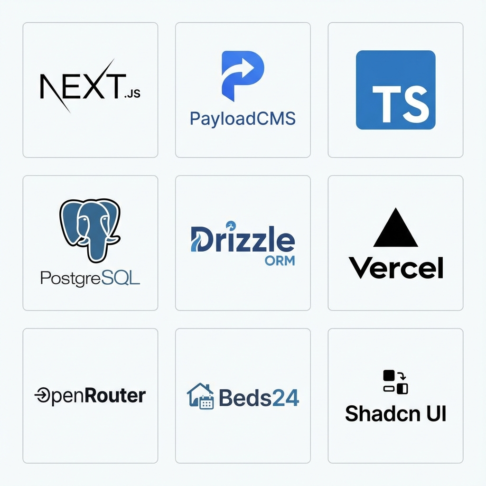
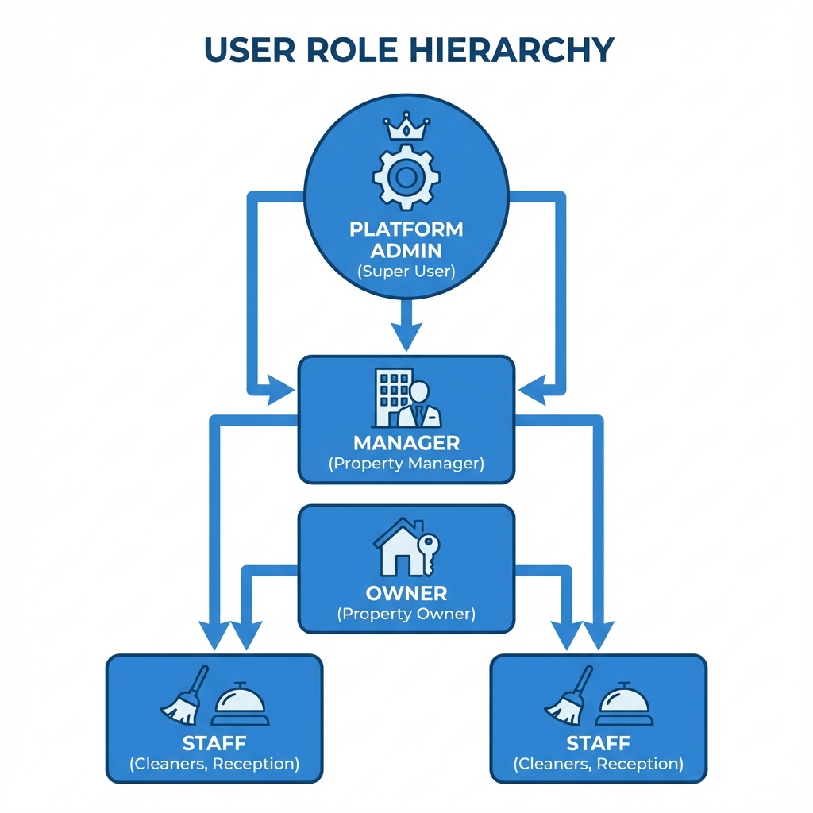
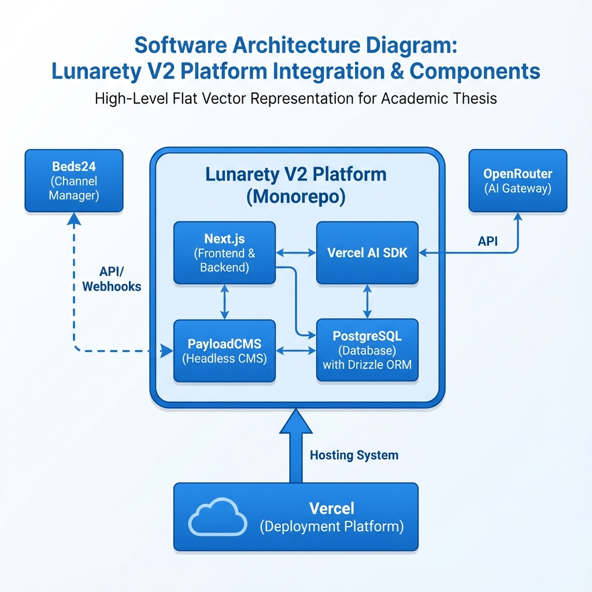
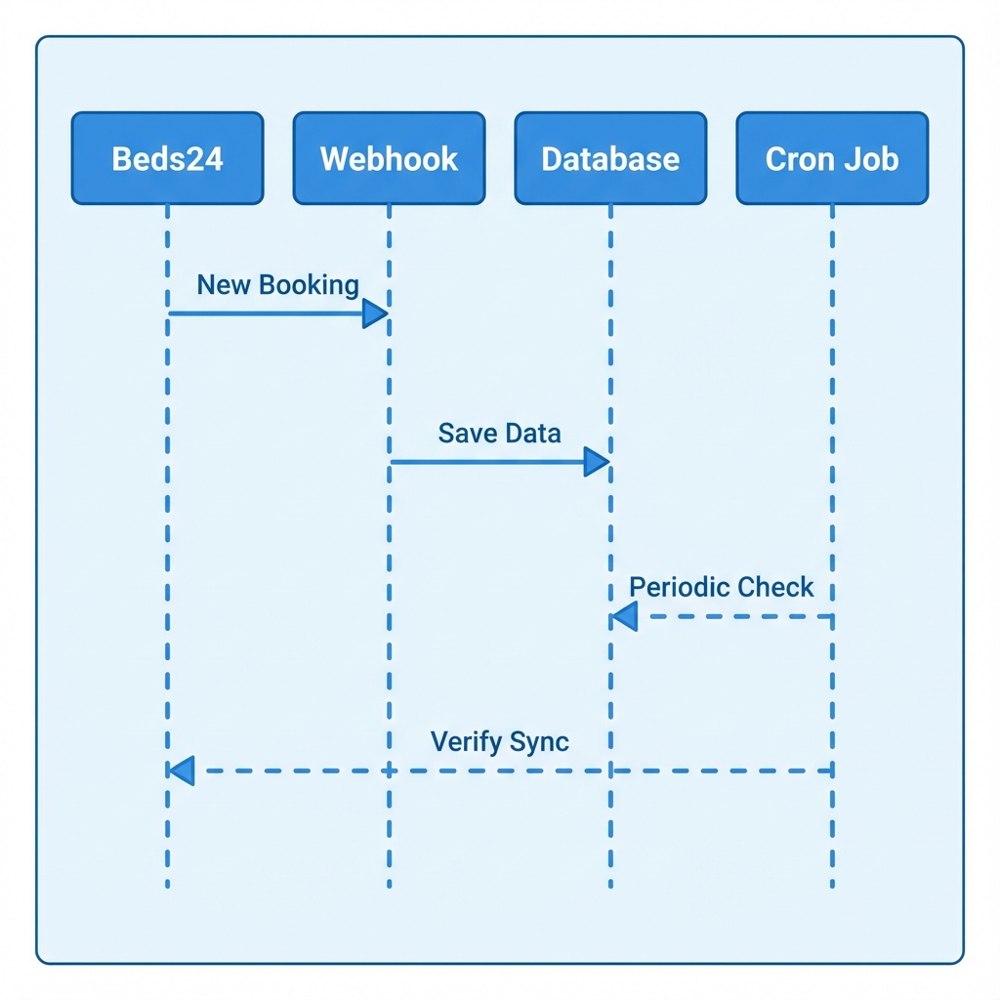
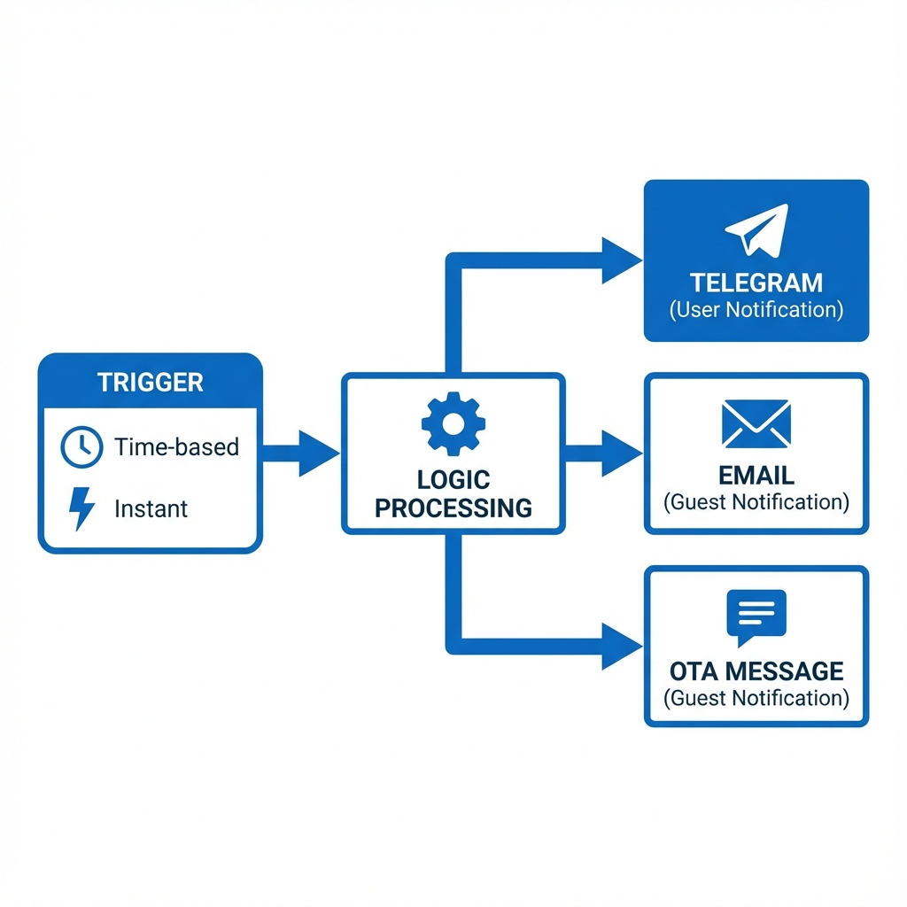
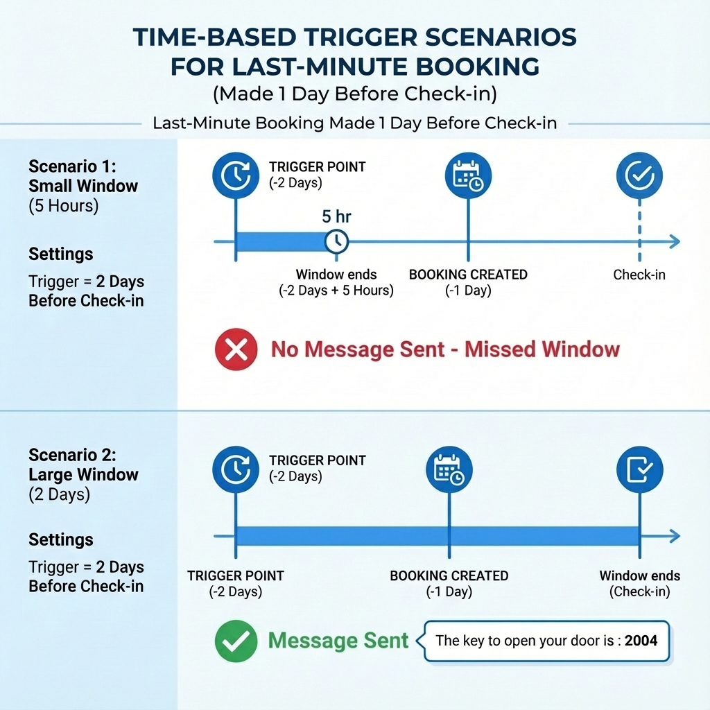

# ΠΟΛΥΤΕΧΝΕΙΟ ΚΡΗΤΗΣ

## ΣΧΟΛΗ ΗΛΕΚΤΡΟΛΟΓΩΝ ΜΗΧΑΝΙΚΩΝ ΚΑΙ ΜΗΧΑΝΙΚΩΝ ΥΠΟΛΟΓΙΣΤΩΝ

# ΣΧΕΔΙΑΣΜΟΣ ΚΑΙ ΥΛΟΠΟΙΗΣΗ ΠΛΑΤΦΟΡΜΑΣ ΔΙΑΧΕΙΡΙΣΗΣ ΤΟΥΡΙΣΤΙΚΩΝ ΚΑΤΑΛΥΜΑΤΩΝ ΜΕ ΕΜΦΑΣΗ ΣΤΟ RAPID DEVELOPMENT ΚΑΙ ΤΗΝ ΕΝΣΩΜΑΤΩΣΗ LLMs

**ΔΙΠΛΩΜΑΤΙΚΗ ΕΡΓΑΣΙΑ**

**ΘΕΟΔΩΡΟΣ ΜΠΑΡΚΑΣ**

**ΧΑΝΙΑ, ΝΟΕΜΒΡΙΟΣ 2025**

# ΠΝΕΥΜΑΤΙΚΑ ΔΙΚΑΙΩΜΑΤΑ

"Απαγορεύεται η αντιγραφή, αποθήκευση και διανομή της παρούσας εργασίας, εξ ολοκλήρου ή τμήματος αυτής, για εμπορικό σκοπό. Επιτρέπεται η ανατύπωση, αποθήκευση και διανομή για μη κερδοσκοπικό σκοπό, εκπαιδευτικού ή ερευνητικού χαρακτήρα, με την προϋπόθεση να αναφέρεται η πηγή προέλευσης. Ερωτήματα που αφορούν τη χρήση της εργασίας για άλλη χρήση θα πρέπει να απευθύνονται προς το συγγραφέα.

Οι απόψεις και τα συμπεράσματα που περιέχονται σε αυτό το έγγραφο εκφράζουν τον συγγραφέα και δεν πρέπει να ερμηνευθεί ότι αντιπροσωπεύουν τις επίσημες θέσεις του Πολυτεχνείου Κρήτης".

# ΕΠΙΤΡΟΠΗ

**Εξεταστική Επιτροπή:**

1. Καθ. Μιχαήλ Γ. Λαγουδάκης (Επιβλέπων)
2. Καθ. Αντώνιος Δεληγιαννάκης
3. Αν. Καθ. Βασίλειος Σαμολαδάς

# ΠΕΡΙΛΗΨΗ

Η παρούσα διπλωματική εργασία πραγματεύεται τον σχεδιασμό και την υλοποίηση της πλατφόρμας "Lunarety V2", ενός προηγμένου συστήματος διαχείρισης τουριστικών καταλυμάτων (Property Management System - PMS) που αξιοποιεί σύγχρονες τεχνολογίες για να προσφέρει λύσεις Rapid Development και ενσωμάτωση Τεχνητής Νοημοσύνης (LLMs). Σκοπός της εργασίας είναι η κάλυψη του κενού που υπάρχει στην αγορά για ένα εργαλείο που απευθύνεται σε διαχειριστές ακινήτων (Managers) οι οποίοι επιβλέπουν πολλαπλούς ιδιοκτήτες (Owners), προσφέροντας διαφάνεια, αυτοματισμό και ευκολία χρήσης που λείπει από τα παραδοσιακά Channel Managers.

Η μεθοδολογία ανάπτυξης βασίστηκε στη χρήση του PayloadCMS v3.0, το οποίο λειτουργεί ως ένα πλήρες backend framework εντός του Next.js, προσφέροντας Code-First ορισμό δομών δεδομένων και ισχυρή τυποποίηση μέσω TypeScript. Η βάση δεδομένων υλοποιήθηκε σε PostgreSQL με χρήση Drizzle ORM, εξασφαλίζοντας ακεραιότητα και ταχύτητα. Η πλατφόρμα ακολουθεί αρχιτεκτονική Monorepo και είναι σχεδιασμένη για Serverless Deployment (π.χ. Vercel), επιτρέποντας στους διαχειριστές να ξεκινούν με μηδενικό κόστος υποδομής και να κλιμακώνονται ανάλογα με τις ανάγκες τους.

Κεντρικό στοιχείο της καινοτομίας αποτελεί η ενσωμάτωση Large Language Models (LLMs) μέσω του Vercel AI SDK και του OpenRouter, προσφέροντας έξυπνες λειτουργίες σε πολλαπλά επίπεδα. Επιπλέον, αναπτύχθηκε ένας μηχανισμός "Auto Actions" για την πλήρη αυτοματοποίηση της επικοινωνίας μέσω πολλαπλών καναλιών (Email, OTA Messages, Telegram).

Η εργασία συνεισφέρει στην κατανόηση του τρόπου με τον οποίο οι σύγχρονες αρχιτεκτονικές λογισμικού και τα εργαλεία Rapid Development μπορούν να μετασχηματίσουν επιχειρησιακές διαδικασίες, προσφέροντας λύσεις υψηλής αξίας με μειωμένο χρόνο ανάπτυξης και συντήρησης.

# ABSTRACT

This diploma thesis deals with the design and implementation of the "Lunarety V2" platform, an advanced Property Management System (PMS) that leverages modern technologies to offer Rapid Development solutions and Large Language Model (LLM) integration. The purpose of this work is to bridge the market gap for a tool tailored to Property Managers overseeing multiple Owners, offering transparency, automation, and ease of use often missing from traditional Channel Managers.

The development methodology was based on PayloadCMS v3.0, acting as a full backend framework within Next.js, offering Code-First data structure definitions and strong typing via TypeScript. The database was implemented in PostgreSQL using Drizzle ORM, ensuring data integrity and performance. The platform follows a Monorepo architecture and is designed for Serverless Deployment (e.g., Vercel), allowing managers to start with zero infrastructure costs and scale as needed.

A key innovation element is the integration of Large Language Models (LLMs) via Vercel AI SDK and OpenRouter, offering smart features at multiple levels. Furthermore, an "Auto Actions" mechanism was developed to fully automate communication through multiple channels (Email, OTA Messages, Telegram).

This work contributes to understanding how modern software architectures and Rapid Development tools can transform business processes, delivering high-value solutions with reduced development and maintenance time.

# ΠΡΟΛΟΓΟΣ

Θα ήθελα να ευχαριστήσω... (Placeholder for Acknowledgements)

# ΠΙΝΑΚΑΣ ΠΕΡΙΕΧΟΜΕΝΩΝ

1. **ΕΙΣΑΓΩΓΗ**
   - 1.1 Αντικείμενο της Μελέτης
   - 1.2 Σκοπός της Διπλωματικής Εργασίας
   - 1.3 Το Κενό στην Αγορά: Managers και Owners
   - 1.4 Συνεισφορά στο Rapid Development
2. **ΘΕΩΡΗΤΙΚΟ ΥΠΟΒΑΘΡΟ**
   - 2.1 Σύγχρονες Αρχιτεκτονικές Web
     - 2.1.1 TypeScript και Type Consistency
     - 2.1.2 PayloadCMS: Backend Framework vs CMS
     - 2.1.3 Next.js, Server Actions και Monorepo
     - 2.1.4 PostgreSQL και Drizzle ORM
     - 2.1.5 Shadcn UI, React και Zustand
     - 2.1.6 Swagger/OpenAPI και Code Generation
   - 2.2 Large Language Models (LLMs)
     - 2.2.1 Vercel AI SDK και Streaming
     - 2.2.2 OpenRouter και Πρόσβαση σε Μοντέλα
   - 2.3 Channel Managers και Διασυνδεσιμότητα
3. **ΜΕΘΟΔΟΛΟΓΙΑ & ΑΝΑΛΥΣΗ ΑΠΑΙΤΗΣΕΩΝ**
   - 3.1 Ρόλοι και Ιεραρχία Χρηστών
   - 3.2 Αρχιτεκτονική Συστήματος (Monorepo)
   - 3.3 Μοντέλο Δεδομένων και Σχέσεις
4. **ΥΛΟΠΟΙΗΣΗ**
   - 4.1 Διαχείριση Κρατήσεων και Συγχρονισμός (Sync Logic)
   - 4.2 Μηχανισμός Auto Actions
     - 4.2.1 Κατηγορίες Auto Actions
     - 4.2.2 Κανάλια Επικοινωνίας (Telegram, OTA, Email)
   - 4.3 Αυτοματοποιημένη Παραγωγή Ιστοσελίδων
     - 4.3.1 Δομή και Λειτουργία Website
     - 4.3.2 Deploy URL & Vercel Integration
     - 4.3.3 Επιχειρηματικές Ευκαιρίες (Platform as OTA)
     - 4.4 Περιβάλλον Χρήστη (Platform UI) 4.4.1 Dashboard & Calendar (Λειτουργικότητα)
     - 4.4.2 Σύστημα Μηνυμάτων (Chat & AI)
     - 4.4.3 Διαχείριση Δικαιωμάτων και Drawers
5. **ΑΠΟΤΕΛΕΣΜΑΤΑ**
   - 5.1 Παρουσίαση της Πλατφόρμας
   - 5.2 Παρουσίαση του Generated Website
   - 5.3 Smart Features & LLM Integration
6. **ΣΥΖΗΤΗΣΗ**
7. **ΣΥΜΠΕΡΑΣΜΑΤΑ**
8. **ΒΙΒΛΙΟΓΡΑΦΙΑ**
9. **ΠΑΡΑΡΤΗΜΑΤΑ**

# ΚΕΦΑΛΑΙΟ 1: ΕΙΣΑΓΩΓΗ

## 1.1 Αντικείμενο της Μελέτης

Το αντικείμενο της παρούσας διπλωματικής εργασίας είναι ο σχεδιασμός και η ανάπτυξη ενός ολοκληρωμένου πληροφοριακού συστήματος, του "Lunarety V2", για τη διαχείριση τουριστικών καταλυμάτων. Η πλατφόρμα δεν αποτελεί απλώς ένα ακόμη PMS, αλλά μια ολιστική λύση που στοχεύει στην κεντρικοποίηση των λειτουργιών που απαιτούνται από επαγγελματίες διαχειριστές (Managers) και τους πελάτες τους, τους ιδιοκτήτες ακινήτων (Owners). Πέρα από τις βασικές λειτουργίες διαχείρισης κρατήσεων και συγχρονισμού ημερολογίων, η πλατφόρμα ενσωματώνει προηγμένες δυνατότητες Τεχνητής Νοημοσύνης (LLMs) για την υποβοήθηση της επικοινωνίας και την παροχή έξυπνων υπηρεσιών.

## 1.2 Σκοπός της ΔΕ

Ο κύριος σκοπός της εργασίας είναι η δημιουργία ενός εργαλείου που μειώνει δραστικά τον διοικητικό φόρτο και εκσυγχρονίζει τις διαδικασίες διαχείρισης. Ειδικότερα, επιδιώκεται:

- Η δημιουργία ενός robust συστήματος διαχείρισης σχέσεων Manager-Owner, προσφέροντας διαφάνεια και αυτοματοποιημένη ενημέρωση.
- Η ενσωμάτωση δυνατοτήτων LLM (Large Language Models) τόσο για την υποβοήθηση των χρηστών στη σύνταξη μηνυμάτων όσο και για την παροχή smart features στους επισκέπτες μέσω των ιστοσελίδων των καταλυμάτων.
- Η υλοποίηση ενός ευέλικτου συστήματος "Auto Actions" τριών επιπέδων για την πλήρη αυτοματοποίηση των εργασιών.
- Η απρόσκοπτη διασύνδεση με τον Channel Manager "Beds24", με αρχιτεκτονική πρόβλεψη για μελλοντική προσθήκη άλλων παρόχων.

## 1.3 Το Κενό στην Αγορά: Managers και Owners

Η παρούσα εργασία απευθύνεται κυρίως σε επαγγελματίες Property Managers που διαχειρίζονται χαρτοφυλάκια ακινήτων που ανήκουν σε τρίτους (Owners). Στην τρέχουσα αγορά, παρατηρείται ένα σημαντικό κενό:

- Οι Managers συχνά αναγκάζονται να χρησιμοποιούν πολύπλοκα λογισμικά Channel Managers, τα οποία είναι δύσχρηστα για τους Owners ή το απλό προσωπικό.
- Η ενημέρωση των Owners για κρατήσεις, πληρότητες και οικονομικά στοιχεία γίνεται συχνά χειροκίνητα (τηλέφωνα, excel, emails), οδηγώντας σε λάθη και καθυστερήσεις.
- Η δημιουργία λογαριασμών για Owners μέσα στα υπάρχοντα Channel Managers είναι συχνά δαπανηρή ή πολύπλοκη διαδικασία.

Το Lunarety V2 έρχεται να καλύψει αυτό το κενό, προσφέροντας μια ενδιάμεση, φιλική προς τον χρήστη πλατφόρμα, όπου ο Manager ορίζει τα δικαιώματα, τις συνδρομές και την πρόσβαση των Owners, παρέχοντάς τους ακριβώς την πληροφορία που χρειάζονται σε πραγματικό χρόνο.

## 1.4 Συνεισφορά στο Rapid Development

Πέρα από την επιχειρησιακή της αξία, η εργασία αυτή αποτελεί μελέτη περίπτωσης για το πώς σύγχρονες τεχνολογίες (Next.js, PayloadCMS, Serverless) συμβάλλουν στο Rapid Application Development (RAD). Η δυνατότητα γρήγορης ανάπτυξης, εύκολου deployment (Serverless) και άμεσης προσαρμογής (Code-First schema) επιτρέπει σε μικρές ομάδες ή μεμονωμένους developers να παράγουν λογισμικό επιχειρησιακού επιπέδου (Enterprise Grade) σε ελάχιστο χρόνο.

# ΚΕΦΑΛΑΙΟ 2: ΘΕΩΡΗΤΙΚΟ ΥΠΟΒΑΘΡΟ

## 2.1 Σύγχρονες Αρχιτεκτονικές Web

_Εικόνα 2.1: Το τεχνολογικό stack της πλατφόρμας (Next.js, PayloadCMS, PostgreSQL, κ.α.)._

### 2.1.1 TypeScript και Type Consistency

### 2.1.1 TypeScript και Type Consistency

Η επιλογή της TypeScript έναντι της JavaScript αποτέλεσε μονόδρομο για την ανάπτυξη μιας σύγχρονης, κλιμακώσιμης εφαρμογής. Η στατική τυποποίηση (static typing) που προσφέρει εξασφαλίζει "Type Consistency" σε όλο το εύρος της εφαρμογής (Fullstack). Αυτό σημαίνει ότι τα δεδομένα που επιστρέφει το Backend είναι εγγυημένα συμβατά με αυτά που περιμένει το Frontend, μειώνοντας δραματικά τα runtime errors και επιταχύνοντας την ανάπτυξη μέσω του IntelliSense.

### 2.1.2 PayloadCMS: Backend Framework vs CMS

Το PayloadCMS (ειδικά από την έκδοση 3.0 και μετά) διαφοροποιείται σημαντικά από τα παραδοσιακά CMS (όπως το WordPress ή το Strapi). Λειτουργεί πρωτίστως ως ένα Backend Framework που τρέχει εντός του Next.js, παρόμοια με το Django ή το Laravel, αλλά με τη δύναμη του TypeScript.

- **Code-First Collections**: Οι δομές δεδομένων (Collections) ορίζονται αποκλειστικά μέσω κώδικα (TypeScript objects), λειτουργώντας ταυτόχρονα ως σχήμα βάσης δεδομένων, μοντέλο API και διεπαφή διαχείρισης.
- **Next.js Integration**: Το backend (Admin panel, API routes, Auth) είναι ενσωματωμένο στην εφαρμογή Next.js, μετατρέποντάς την σε μια full-stack λύση χωρίς την ανάγκη ξεχωριστού server.

### 2.1.3 Next.js, Server Actions και Monorepo

Το Next.js επιλέχθηκε όχι μόνο για τις δυνατότητες Rendering (SSR, SSG) αλλά και για την άριστη συμβατότητά του με Serverless υποδομές.

- **Server Actions**: Μια κρίσιμη λειτουργία που επιτρέπει στο Frontend να καλεί συναρτήσεις του Backend απευθείας, χωρίς την ανάγκη ρητού ορισμού API Endpoints. Αυτό απλοποιεί τη διαχείριση δεδομένων και διατηρεί την τυποποίηση (types) από άκρη σε άκρη.
- **Monorepo**: Η διατήρηση όλου του κώδικα (Frontend, Backend, Webhooks) σε ένα ενιαίο Repository επιτρέπει την κοινή χρήση τύπων και utilities, εξαλείφοντας την ανάγκη για συγχρονισμό μεταξύ διαφορετικών projects.

### 2.1.4 PostgreSQL και Drizzle ORM

Η πλατφόρμα βασίζεται στην PostgreSQL, μια ισχυρή σχεσιακή βάση δεδομένων. Η επικοινωνία με τη βάση γίνεται μέσω του Drizzle ORM, το οποίο είναι πλήρως συμβατό με το PayloadCMS.

- **Low-Level Capabilities**: Το Drizzle επιτρέπει στον developer να γράψει σύνθετα SQL queries όταν οι abstraction layers του CMS δεν επαρκούν, προσφέροντας απόλυτο έλεγχο στην απόδοση.
- **Type Safety**: Πλήρης τυποποίηση των queries βάσει του σχήματος της βάσης.

### 2.1.5 Shadcn UI, React και Zustand

Για το User Interface χρησιμοποιήθηκε το Shadcn UI, το οποίο διαφέρει από τις παραδοσιακές βιβλιοθήκες (όπως το Material UI) καθώς δεν είναι ένα npm package, αλλά κώδικας που αντιγράφεται μέσα στο project. Αυτό δίνει απόλυτη ελευθερία παραμετροποίησης.

- **React**: Η βάση του frontend για τη δημιουργία επαναχρησιμοποιήσιμων components.
- **Zustand**: Χρησιμοποιήθηκε για τη διαχείριση της κατάστασης (state management) της εφαρμογής, προσφέροντας μια πιο απλή και ελαφριά εναλλακτική στο Redux.

### 2.1.6 Swagger/OpenAPI και Code Generation

Για την επικοινωνία μεταξύ της Πλατφόρμας και των Websites, χρησιμοποιήθηκε το πρότυπο OpenAPI (Swagger).

- **Generation**: Η βιβλιοθήκη `next-swagger-doc` παράγει αυτόματα το documentation του API.
- **Client**: Η βιβλιοθήκη `openapi-typescript-codegen` χρησιμοποιείται στο Website project για να παράγει έναν πλήρως τυποποιημένο client (SDK), εξασφαλίζοντας ότι το Website είναι πάντα συγχρονισμένο με τις αλλαγές στο API της πλατφόρμας.

## 2.2 Large Language Models (LLMs)

Η ενσωμάτωση LLMs (μέσω API όπως OpenAI ή Anthropic) μεταμορφώνει τις εφαρμογές από στατικά εργαλεία σε έξυπνους βοηθούς. Στο πλαίσιο του PMS, τα LLMs μπορούν να αναλύσουν το context μιας κράτησης και να προτείνουν απαντήσεις, να μεταφράσουν μηνύματα ή να λειτουργήσουν ως virtual concierges στις ιστοσελίδες των καταλυμάτων.

### 2.2.1 Vercel AI SDK και Streaming

Για την υλοποίηση των AI λειτουργιών χρησιμοποιήθηκε το **Vercel AI SDK (v5)**. Το SDK αυτό επιλέχθηκε διότι απλοποιεί δραματικά τη διαδικασία του **Streaming** (ροή δεδομένων), επιτρέποντας στο UI να εμφανίζει την απάντηση του AI σταδιακά (λέξη-λέξη) καθώς παράγεται, βελτιώνοντας την εμπειρία χρήστη.

### 2.2.2 OpenRouter και Πρόσβαση σε Μοντέλα

Η πλατφόρμα δεν συνδέεται απευθείας με έναν πάροχο (π.χ. OpenAI), αλλά χρησιμοποιεί το **OpenRouter**. Το OpenRouter λειτουργεί ως ένας ενδιάμεσος κόμβος (gateway) που παρέχει πρόσβαση σε πληθώρα μοντέλων (GPT-4, Claude 3.5 Sonnet, Llama 3, κ.α.) μέσω ενός ενιαίου API. Αυτό δίνει την ευελιξία στον χρήστη να επιλέξει το μοντέλο που ταιριάζει καλύτερα στις ανάγκες και το budget του, χωρίς αλλαγές στον κώδικα.

## 2.3 Channel Managers και Διασυνδεσιμότητα

Η επιλογή του **Beds24** ως Channel Manager δεν ήταν τυχαία. Επιλέχθηκε διότι:

1. **Δημοφιλία & Κόστος**: Είναι μια από τις πιο διαδεδομένες και οικονομικές λύσεις στην αγορά.
2. **Modern API**: Διαθέτει ένα σύγχρονο, comprehensive API με υποστήριξη OpenAPI, το οποίο επιτρέπει την εύκολη παραγωγή κώδικα (μέσω `swagger-typescript-api`) και την άμεση προσαρμογή σε μελλοντικά updates.

# ΚΕΦΑΛΑΙΟ 3: ΜΕΘΟΔΟΛΟΓΙΑ & ΑΝΑΛΥΣΗ ΑΠΑΙΤΗΣΕΩΝ

## 3.1 Ρόλοι και Ιεραρχία Χρηστών

Το σύστημα σχεδιάστηκε με γνώμονα την ιεραρχία Manager-Owner:

1. **Platform Users (Admins)**: Οι διαχειριστές της πλατφόρμας Lunarety. Έχουν καθολική εποπτεία.
2. **Managers**: Ο κεντρικός κόμβος. Συνδέουν το Channel Manager τους, δημιουργούν πλάνα χρέωσης και εισάγουν τους Owners τους.
3. **Owners**: Πελάτες του Manager. Βλέπουν μόνο τα δικά τους ακίνητα και οικονομικά στοιχεία. Η πρόσβασή τους καθορίζεται αυστηρά από τον Manager.
4. **Staff**: Υπάλληλοι (καθαριστές, υποδοχή) που ανήκουν είτε σε Manager είτε σε Owner, με περιορισμένα δικαιώματα (π.χ. view-only στο ημερολόγιο).

_Εικόνα 3.1: Ιεραρχική δομή ρόλων χρηστών στην πλατφόρμα._

## 3.2 Αρχιτεκτονική Συστήματος (Monorepo)

Η πλατφόρμα υλοποιείται ως Monorepo, το οποίο περιλαμβάνει:

- Τον πυρήνα της εφαρμογής (PayloadCMS + Next.js).
- Τους Webhook Handlers για την επικοινωνία με τρίτα συστήματα.
- Τα Cron Jobs για τις χρονοπρογραμματισμένες εργασίες.

_Εικόνα 3.2: Διάγραμμα αρχιτεκτονικής συστήματος (Monorepo)._

Παράλληλα, το `lunarety-v2-website` αποτελεί ένα ξεχωριστό public project στο GitHub, σχεδιασμένο να λειτουργεί ως template για τις ιστοσελίδες των καταλυμάτων, το οποίο όμως συνδέεται άμεσα με την πλατφόρμα μέσω API.

## 3.3 Μοντέλο Δεδομένων και Σχέσεις

Η βάση δεδομένων (PostgreSQL) οργανώνεται γύρω από τις εξής κύριες οντότητες:

- **Users**: Περιλαμβάνει ιεραρχικές σχέσεις (parent-child) για τη σύνδεση Manager-Owner-Staff.
- **Properties**: Τα ακίνητα, τα οποία συνδέονται με `propId` του Beds24 και ανήκουν σε έναν Manager και (προαιρετικά) σε έναν Owner.
- **Bookings**: Κεντρικός πίνακας κρατήσεων με πλήρη στοιχεία πελάτη και οικονομικά δεδομένα.
- **Auto-Actions**: Πίνακας κανόνων αυτοματισμού.

# ΚΕΦΑΛΑΙΟ 4: ΥΛΟΠΟΙΗΣΗ

## 4.1 Διαχείριση Κρατήσεων και Συγχρονισμός

Η διασύνδεση με το Beds24 είναι κρίσιμη και ακολουθεί μια συγκεκριμένη ροή:

1. **Σύνδεση Λογαριασμού**: Ο Manager εισάγει το API Key του Beds24.
2. **Initial Import**: Κατά την εισαγωγή του κλειδιού, το σύστημα εκτελεί μια μαζική εισαγωγή (Import) όλων των Properties και των Rates που είναι ορισμένα στο Channel Manager.
3. **Webhook Configuration**: Το σύστημα αυτόματα ενημερώνει τις ρυθμίσεις του Beds24 ώστε να στέλνει Webhooks στο endpoint της πλατφόρμας (`/api/webhooks/channel-managers/beds24/bookings`).
4. **Async Updates**: Από εκείνη τη στιγμή, κάθε αλλαγή (νέα κράτηση, αλλαγή ημερομηνίας) έρχεται ασύγχρονα μέσω Webhook.
5. **Scheduled Sync**: Για λόγους ασφαλείας και συνέπειας, εκτελείται περιοδικός συγχρονισμός (π.χ. στο τέλος της ημέρας) για να διορθωθούν τυχόν χαμένα πακέτα.

_Εικόνα 4.1: Ροή δεδομένων συγχρονισμού κρατήσεων με το Beds24._

## 4.2 Μηχανισμός Auto Actions

Το σύστημα Auto Actions είναι η "καρδιά" του αυτοματισμού.

### 4.2.1 Κατηγορίες Auto Actions

Υπάρχουν τρεις διακριτοί τύποι:

1. **Notifications to Users**: Ειδοποιήσεις προς τους χρήστες της πλατφόρμας (Managers, Owners, Staff).
2. **Property Notifications to Guests**: Μηνύματα προς τους επισκέπτες (π.χ. οδηγίες άφιξης).
3. **Simple Template**: Πρότυπα κειμένου χωρίς συνθήκη ενεργοποίησης (trigger condition), τα οποία χρησιμοποιούνται αποκλειστικά για χειροκίνητη αποστολή μέσω του Chat.

### 4.2.2 Κανάλια Επικοινωνίας

Το σύστημα υποστηρίζει πολλαπλά κανάλια (`preferableChannels`) και προσπαθεί να στείλει το μήνυμα με σειρά προτεραιότητας.

- **Για Guests**: `OTA Message` (μέσω API καναλιού) ή `Email`.
- **Για Users**: `Telegram`. Οι χρήστες μπορούν να κάνουν Subscribe στο Telegram Bot της πλατφόρμας και να λαμβάνουν άμεσες ειδοποιήσεις στο κινητό τους. Η αρχιτεκτονική είναι σχεδιασμένη ώστε να επιτρέπει την εύκολη προσθήκη νέων καναλιών (π.χ. WhatsApp, SMS) στο μέλλον.

_Εικόνα 4.2: Διάγραμμα ροής εκτέλεσης των Auto Actions._

### 4.2.1 Time-based Triggers (Cron Jobs)

Αυτές οι ενέργειες εκτελούνται βάσει χρόνου σε σχέση με ένα γεγονός της κράτησης.

- **Trigger Types**: `before-checkin`, `after-checkout`, `after-cancellation`, `after-new-booking`.
- **Λογική Εκτέλεσης**: Ένα Cron Job τρέχει κάθε ώρα (everyHourCron.ts). Για κάθε ενεργό Auto Action, υπολογίζει ένα χρονικό παράθυρο [`fromDate`, `toDate`] βάσει του `timeInterval` και `timeWindow`.
  - _Παράδειγμα_: Για ενέργεια "2 μέρες πριν την άφιξη", το σύστημα ψάχνει κρατήσεις με `checkInDate` που εμπίπτει στο διάστημα `[Τώρα + 48 ώρες, Τώρα + 48 ώρες + Window]`.
- **Query**: Χρησιμοποιείται το Drizzle/Payload API για να βρεθούν οι κρατήσεις που πληρούν τα κριτήρια και δεν έχουν ήδη λάβει την ειδοποίηση (έλεγχος στο `logging.automationTracking`).

_Εικόνα 4.3: Σενάρια λειτουργίας Time-based Triggers για κράτηση της τελευταίας στιγμής (1 μέρα πριν την άφιξη). Στο Σενάριο 1 (μικρό παράθυρο 5 ωρών), η κράτηση χάνει τον κανόνα "2 μέρες πριν" και δεν στέλνεται μήνυμα. Στο Σενάριο 2 (μεγάλο παράθυρο 2 ημερών), η κράτηση εμπίπτει στο παράθυρο και το μήνυμα (π.χ. "The key to open your door is : 2004") αποστέλλεται κανονικά._

### 4.2.2 Instant Triggers (Webhooks)

Ενέργειες που εκτελούνται άμεσα μόλις συμβεί το γεγονός.

- **Trigger Types**: `on-new-message`, `on-update`.
- **Υλοποίηση**: Αυτές οι ενέργειες δεν περιμένουν το Cron. Καλούνται απευθείας μέσα από τον Webhook Handler (
  
  route.ts) μόλις ολοκληρωθεί επιτυχώς η αποθήκευση της κράτησης/μηνύματος.

## 4.3 Αυτοματοποιημένη Παραγωγή Ιστοσελίδων

### 4.3.1 Δομή και Λειτουργία Website

Το παραγόμενο website ακολουθεί μια βελτιστοποιημένη δομή τριών κύριων σελίδων:

1. **Home Page (`/`)**: Κεντρική σελίδα με Multi-room search.
2. **Property Page (`/properties/[propertyId]`)**: Σελίδα λεπτομερειών καταλύματος.
3. **Booking Management (`/booking/[bookingId]`)**: Σελίδα διαχείρισης κράτησης για τον επισκέπτη.

### 4.3.2 Deploy URL & Vercel Integration

Η διαδικασία "One-Click Deploy" χρησιμοποιεί το Vercel Deploy URL για να κλωνοποιήσει το public repo `lunarety-v2-website` και να θέσει το `WEBSITE_API_KEY` αυτόματα.

### 4.3.3 Επιχειρηματικές Ευκαιρίες (Platform as OTA)

Η ευελιξία του συστήματος δημιουργεί νέες επιχειρηματικές ευκαιρίες. Ένας χρήστης με κατάλληλα δικαιώματα μπορεί να δημιουργήσει πολλαπλά websites: ένα για κάθε Owner (με τα δικά του ακίνητα) και ένα συγκεντρωτικό "Platform Website" με όλα τα ακίνητα του Manager. Αυτό επιτρέπει στον Manager να λειτουργήσει ως ένα μικρό OTA (Online Travel Agency), κρατώντας προμήθεια από τους Owners για τις απευθείας κρατήσεις, παρακάμπτοντας τις χρεώσεις τρίτων πλατφορμών.

## 4.4 Περιβάλλον Χρήστη (Platform UI)

### 4.4.1 Dashboard & Calendar (Λειτουργικότητα)

Το ημερολόγιο δεν υποστηρίζει drag-and-drop για λόγους ακρίβειας. Αντ' αυτού, προσφέρει εργαλεία μαζικής επεξεργασίας:

- **Επιλογή Κρατήσεων**: Ο χρήστης επιλέγει μια κράτηση για να δει λεπτομέρειες ή να την επεξεργαστεί.
- **Επιλογή Ημερομηνιών**: Ο χρήστης επιλέγει ένα εύρος ημερομηνιών και μπορεί να αλλάξει μαζικά τιμές και διαθεσιμότητα.
- **Φίλτρα**: Δυνατότητα επιλογής συγκεκριμένων καταλυμάτων για προβολή.

### 4.4.2 Σύστημα Μηνυμάτων (Chat & AI)

Χρήστες με τα κατάλληλα δικαιώματα μπορούν να απαντήσουν σε φιλοξενούμενους απευθείας στα συνδεδεμένα OTAs μέσω της διεπαφής συνομιλίας. Στη σελίδα `/messages`, παρέχεται πρόσβαση σε όλα τα πρόσφατα μηνύματα, τα οποία επιστρέφονται ταξινομημένα από το νεότερο στο παλαιότερο και υποστηρίζουν πλήρη σελιδοποίηση με infinite scrolling. Ο χρήστης μπορεί να αναζητήσει συνομιλίες χρησιμοποιώντας φίλτρα όπως το όνομα κράτησης, το κατάλυμα ή το κείμενο του τελευταίου μηνύματος. Επιπλέον, το Chat επιτρέπει τη χρήση των **Simple Templates** (που συμπληρώνονται αυτόματα με στοιχεία της κράτησης) και τη βελτίωση κειμένου μέσω AI ("Improve with AI").

### 4.4.3 Διαχείριση Δικαιωμάτων και Drawers

Η επεξεργασία γίνεται μέσω UI Drawers με δυναμικό περιεχόμενο βάσει δικαιωμάτων.

- **Παράδειγμα**: Ένας Manager μπορεί να ορίσει ότι ο χρήστης "Καθαριστής" (Staff) μπορεί να βλέπει τις κρατήσεις αλλά *δεν* μπορεί να δει τα στοιχεία επικοινωνίας του πελάτη ούτε να αλλάξει τις ημερομηνίες. Το Drawer θα προσαρμοστεί αυτόματα, κρύβοντας ή απενεργοποιώντας τα αντίστοιχα πεδία.

**Στρατηγικές Ενημέρωσης (Update Strategies):**

- **Booking Update**: Ενεργοποιεί το πλήρες lifecycle (επικοινωνία με Channel Manager -> update/create booking).
- **Availability Update**: Για να αποφευχθεί ο φόρτος στο Channel Manager (ένα request ανά ημέρα), ακολουθείται άλλη στρατηγική. Γίνεται πρώτα μαζικό update στο Channel Manager και, εφόσον επιτύχει, ενημερώνονται απευθείας τα Rates στη βάση δεδομένων (Direct DB Update), παρακάμπτοντας τα hooks για ταχύτητα.

# ΚΕΦΑΛΑΙΟ 5: ΑΠΟΤΕΛΕΣΜΑΤΑ

## 5.1 Παρουσίαση της Πλατφόρμας

Η πλατφόρμα προσφέρει ένα μοντέρνο, responsive περιβάλλον εργασίας. Στα παρακάτω οπτικά παραδείγματα (GIFs) παρουσιάζεται η οπτική γωνία ενός χρήστη με πλήρη δικαιώματα (Admin/Manager). Είναι σημαντικό να τονιστεί ότι χρήστες με διαφορετικούς ρόλους (όπως Owners ή Staff) ενδέχεται να μην έχουν τη δυνατότητα επεξεργασίας ή ακόμη και προβολής όλων των τμημάτων που απεικονίζονται, ανάλογα με τα δικαιώματα που τους έχουν εκχωρηθεί.

_Εικόνα 5.1: Η σελίδα του Ημερολογίου (Calendar)._
Το αρχικό ημερολόγιο έχει σχεδιαστεί ως ένα "Easy Calendar". Για τον βασικό χρήστη, λειτουργεί ως μια απλή λίστα καθηκόντων που δείχνει τι πρέπει να γίνει κάθε μέρα (αφίξεις, αναχωρήσεις), καθιστώντας το εξαιρετικά εύχρηστο για την καθημερινότητα. Ωστόσο, προσφέρει τη δυνατότητα προσθήκης περισσότερης λειτουργικότητας για πιο απαιτητικούς χρήστες, χωρίς να θυσιάζεται η ευκολία χρήσης.

_Εικόνα 5.2: Η σελίδα των Μηνυμάτων._
Το σύστημα μηνυμάτων παρέχει δυνατότητες άμεσης επικοινωνίας, υποστηρίζοντας τη χρήση προτύπων (templates) και τη βελτίωση κειμένου μέσω AI.

.gif>)
_Εικόνα 5.3: Διαχείριση Χρηστών (Users) στο Advanced Dashboard._

.gif>)
_Εικόνα 5.4: Διαχείριση Πλάνων Χρέωσης (Plans) στο Advanced Dashboard._

.gif>)
_Εικόνα 5.5: Διαχείριση Αυτοματισμών (Auto Actions) στο Advanced Dashboard._

## 5.2 Παρουσίαση του Generated Website

Η πλατφόρμα παρέχει τη δυνατότητα αυτόματης παραγωγής ιστοσελίδων για τα καταλύματα, προσφέροντας μια ολοκληρωμένη εμπειρία τόσο για τον διαχειριστή όσο και για τον επισκέπτη.

.gif>)
_Εικόνα 5.6: Διαδικασία παραγωγής Website από το περιβάλλον του διαχειριστή._
Ο διαχειριστής μπορεί με απλά βήματα να δημιουργήσει και να δημοσιεύσει την ιστοσελίδα του καταλύματος, αξιοποιώντας τα δεδομένα που είναι ήδη καταχωρημένα στην πλατφόρμα.

.gif>)
_Εικόνα 5.7: Πλοήγηση επισκέπτη στην παραγόμενη ιστοσελίδα._
Η ιστοσελίδα που παράγεται είναι πλήρως λειτουργική, επιτρέποντας στον επισκέπτη να δει λεπτομέρειες του καταλύματος, φωτογραφίες και παροχές, καθώς και να προχωρήσει σε κράτηση.

.gif>)
_Εικόνα 5.8: Δυνατότητες AI και LLM για την εξυπηρέτηση επισκεπτών._
Ενσωματωμένες δυνατότητες Τεχνητής Νοημοσύνης επιτρέπουν στους επισκέπτες να αλληλεπιδρούν με έξυπνους βοηθούς για να λαμβάνουν άμεσες απαντήσεις σε ερωτήματα σχετικά με το κατάλυμα και την περιοχή.

## 5.3 Smart Features & LLM Integration

Η ενσωμάτωση LLMs προσφέρει απτά οφέλη:

- **Smart Chat (Platform)**: Στο περιβάλλον μηνυμάτων, το AI προτείνει απαντήσεις λαμβάνοντας υπόψη το ιστορικό της συνομιλίας και τις πληροφορίες της κράτησης.
- **Website AI Assistant (OpenRouter)**: Στις ιστοσελίδες των καταλυμάτων (`/properties/[propertyId]`), υπάρχει η δυνατότητα ενεργοποίησης ενός **AI Chat Bubble**.
  - **Configuration**: Ο Manager μπορεί να εισάγει ένα `OpenRouter API Key` στις ρυθμίσεις του Website.
  - **Context-Aware**: Το Chat Bubble είναι "Fixed" στη γωνία της οθόνης. Γνωρίζει τα πάντα για το κατάλυμα (παροχές, τοποθεσία) αλλά και δυναμικά δεδομένα όπως **τρέχουσα διαθεσιμότητα και τιμές**. Έτσι, μπορεί να απαντήσει σε ερωτήσεις τύπου "Είναι ελεύθερο το σπίτι για το επόμενο Σαββατοκύριακο και πόσο κοστίζει;" με ακρίβεια, λειτουργώντας ως ένας 24/7 ψηφιακός ρεσεψιονίστ.

# ΚΕΦΑΛΑΙΟ 6: ΣΥΖΗΤΗΣΗ

Η υιοθέτηση του μοντέλου "Backend Framework" με το PayloadCMS v3 και η χρήση Serverless υποδομών απέδειξε ότι είναι δυνατή η ανάπτυξη πολύπλοκων εφαρμογών με ελάχιστους πόρους (Rapid Development). Η επιλογή της PostgreSQL έναντι της MongoDB δικαιώθηκε από την ανάγκη για αυστηρές σχέσεις μεταξύ των οντοτήτων (Manager-Owner-Property). Η μεγαλύτερη πρόκληση ήταν η διαχείριση της ασύγχρονης φύσης των Webhooks και η διασφάλιση της συνοχής των δεδομένων, η οποία αντιμετωπίστηκε επιτυχώς με τη χρήση transactions.

Ένα σημείο που αναγνωρίζεται ως πεδίο μελλοντικής βελτιστοποίησης είναι η εμπειρία χρήστη (UX) στις περιοχές διαμόρφωσης του συστήματος, και συγκεκριμένα στη διαχείριση Χρηστών (Users), Αυτοματισμών (Auto Actions) και Πλάνων (Plans). Επί του παρόντος, αυτές οι λειτουργίες βασίζονται στο default στυλ του Payload CMS, το οποίο παρουσιάζει μια πιο σύνθετη εμπειρία χρήσης σε σχέση με το υπόλοιπο custom UI της πλατφόρμας. Η επιλογή αυτή έγινε με γνώμονα την εστίαση στην τελειοποίηση των εργαλείων καθημερινής διαχείρισης (ξενοδοχεία και διαμερίσματα), τα οποία αποτελούν τον πυρήνα της δραστηριότητας. Οι ρυθμίσεις Χρηστών, Πλάνων και Αυτοματισμών ενημερώνονται σπάνια και κυρίως από εκπαιδευμένους Managers, και λιγότερο από τους Owners, οι οποίοι επιζητούν μια έτοιμη λύση ("out-of-the-box") που θα διαχειρίζεται για αυτούς ο Manager.

# ΚΕΦΑΛΑΙΟ 7: ΣΥΜΠΕΡΑΣΜΑΤΑ

Η πλατφόρμα Lunarety V2 επιτυγχάνει τον στόχο της να γεφυρώσει το χάσμα μεταξύ Channel Managers και ιδιοκτητών ακινήτων. Παρέχει στους Managers ένα ισχυρό εργαλείο για να προσφέρουν προστιθέμενη αξία στους πελάτες τους (Owners), ενώ παράλληλα αυτοματοποιεί χρονοβόρες διαδικασίες μέσω των Auto Actions και της Τεχνητής Νοημοσύνης. Η αρχιτεκτονική της επιτρέπει εύκολη επέκταση και συντήρηση, καθιστώντας την μια βιώσιμη λύση για τη σύγχρονη αγορά βραχυχρόνιας μίσθωσης.

# ΒΙΒΛΙΟΓΡΑΦΙΑ

1. [Beds24, 2024] Beds24 API Documentation v2.0. Available at: [https://beds24.com/api/v2/](https://beds24.com/api/v2/)
2. [PayloadCMS, 2024] PayloadCMS Documentation. Available at: [https://payloadcms.com/docs](https://payloadcms.com/docs)
3. [Next.js, 2024] Next.js Documentation. Available at: [https://nextjs.org/docs](https://nextjs.org/docs)
4. [Vercel, 2024] Vercel Deployment Documentation. Available at: [https://vercel.com/docs](https://vercel.com/docs)
5. [Drizzle ORM, 2024] Drizzle ORM Documentation. Available at: [https://orm.drizzle.team/](https://orm.drizzle.team/)
6. [Shadcn UI, 2024] Shadcn UI Documentation. Available at: [https://ui.shadcn.com/](https://ui.shadcn.com/)
7. [Vercel AI SDK, 2024] Vercel AI SDK Documentation. Available at: [https://sdk.vercel.ai/docs](https://sdk.vercel.ai/docs)
8. [OpenRouter, 2024] OpenRouter Documentation. Available at: [https://openrouter.ai/docs](https://openrouter.ai/docs)

# ΠΑΡΑΡΤΗΜΑΤΑ

## Παράρτημα Α: Δομή Webhook Payload

`json { "booking": { "id": 12345, "arrival": "2025-01-01", "departure": "2025-01-05", "status": "confirmed" }, "messages": [...] } `

## Παράρτημα Β: Παράδειγμα Auto Action Query (Cron)

`typescript // Αναζήτηση κρατήσεων για 'before-checkin' trigger const whereClause = { 'resource.checkInStartOfDay': { greater_than_equal: fromDate.toISOString(), less_than_equal: toDate.toISOString(), }, 'logging.automationTracking.triggeredAutomations': { not_in: [autoAction.id], } } `
